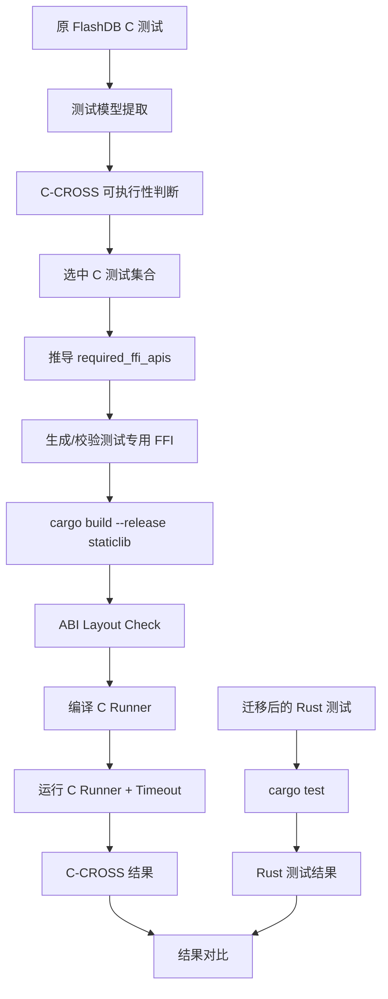

# FlashDB C-CROSS 交叉验证设计说明书

## 1. 文档目的

本文档用于指导开发 `Rust 实现 + 原 C 测试用例` 的 C-CROSS 交叉验证能力。

该能力不用于替代 Rust 测试，也不用于构建完整的 C ABI 兼容产品。其唯一目的，是在 C-to-Rust 迁移过程中，用未迁移的原 C 测试作为独立参照，辅助区分以下两类问题：

1. Rust 源码迁移错误；
2. Rust 测试用例迁移错误。

最终工程保留两条验证链路：

```text
链路 A：Rust 实现 + 原 C 测试
链路 B：Rust 实现 + 迁移后的 Rust 测试
```

不建设以下链路：

```text
C 实现 + C 测试
C 实现 + Rust 测试
```

---

## 2. 背景与问题定义

### 2.1 当前迁移流程

当前工程同时迁移：

- FlashDB C 核心源码；
- FlashDB C 测试用例。

迁移后直接执行：

```text
Rust 实现 + Rust 测试
```

当测试失败时，无法直接判断：

- Rust 实现是否错误；
- Rust 测试是否错误；
- 两者是否同时错误。

### 2.2 C-CROSS 的作用

原 C 测试未经过迁移，通常比迁移后的 Rust 测试更接近原始语义。因此引入：

```text
原 C 测试
    ↓
测试专用 FFI 桥接层
    ↓
Rust 实现
```

通过原 C 测试验证 Rust 实现。

### 2.3 结果解释

| Rust + C | Rust + Rust | 主要判断 |
|---|---|---|
| 通过 | 通过 | 当前测试覆盖范围内，Rust 实现和 Rust 测试均正常 |
| 通过 | 失败 | 优先检查 Rust 测试迁移 |
| 失败 | 失败 | 优先检查 Rust 实现或 FFI 桥接 |
| 失败 | 通过 | 优先检查 FFI、C 测试与 Rust 测试覆盖差异 |

注意：

> Rust + C 通过，只能证明在原 C 测试覆盖范围内，Rust 实现符合原行为，不能证明 Rust 实现绝对正确。

---

## 3. 设计目标

### 3.1 功能目标

1. 识别哪些原 C 测试适合用于 C-CROSS；
2. 根据已选 C 测试自动推导需要的 Rust FFI 接口；
3. 生成最小测试桥接层；
4. 编译 Rust `staticlib`；
5. 编译原 C 测试 runner 并链接 Rust `staticlib`；
6. 执行 C runner；
7. 对 runner 增加超时保护；
8. 保存运行日志；
9. 输出 C-CROSS 执行结果；
10. 与 Rust 测试结果按场景进行对比。

### 3.2 非目标

本项目不建设：

1. 完整 FlashDB C ABI 兼容层；
2. 完整 FFI SDK；
3. 独立发布的 C 接口库；
4. C 实现与 Rust 实现的四向验证矩阵；
5. 自动修复失败测试；
6. 自动生成空实现或桩函数；
7. 为了 C-CROSS 复刻所有 C 私有结构；
8. 在 FFI 层重复实现 KVDB、TSDB、GC 等业务逻辑。

---

## 4. 总体架构



---

## 5. 核心设计原则

### 5.1 C-CROSS 是测试桥，不是第二套实现

FFI 层只允许：

- C 参数转换；
- C 字符串转换；
- C 指针/句柄转换；
- C 枚举和 Rust 枚举转换；
- Rust 错误码映射；
- 回调参数适配；
- 调用已有 Rust 核心实现。

FFI 层禁止：

- 重新实现 KV 读写；
- 重新实现 GC；
- 重新实现 sector 管理；
- 重新实现 TSDB 状态机；
- 使用固定返回值绕过逻辑；
- 使用 `todo!()`、`unimplemented!()`、空实现；
- 修改原 C 测试断言以换取通过；
- 使用测试桩替代真实 Rust 实现。

### 5.2 先选测试，再推导 FFI

正确顺序：

```text
确定哪些 C 测试进入 C-CROSS
    ↓
统计这些测试调用的 FlashDB API
    ↓
推导 required_ffi_apis
    ↓
生成最小 FFI
```

错误顺序：

```text
把所有 FlashDB C API 都做成 FFI
    ↓
再决定跑哪些测试
```

### 5.3 尽量运行全部“行为测试”

默认策略：

> 所有能够通过薄 FFI 调用 Rust 实现，并验证等价行为的 C 测试，都应进入 C-CROSS。

只排除：

- 依赖 C 私有函数；
- 依赖 C 私有全局变量；
- 强依赖精确 C 私有内存布局；
- 必须在 FFI 中重写业务逻辑才能执行；
- 测试目标仅为 C 实现细节，而不是功能行为。

---

## 6. C 测试筛选规则

### 6.1 输入信息

`build_c_model.py` 需要为每个测试提取：

```json
{
  "scenario_id": "case_7",
  "test_name": "test_fdb_del_kv",
  "invocation_index": 1,
  "called_functions": [],
  "accessed_fields": [],
  "referenced_globals": [],
  "used_types": [],
  "assertions": [],
  "source_file": "",
  "source_line": 0
}
```

`invocation_index`：当同一 C 测试函数在同一 runner 中被 `TEST_RUN()` 多次调用时，第 N 次调用的 `invocation_index` 为 N。例如 `test_fdb_tsl_clean` 在 TSDB runner 中被调用两次，第一次 `invocation_index=1` 对应 `scenario_id=test_fdb_tsl_clean`，第二次 `invocation_index=2` 对应 `scenario_id=test_fdb_tsl_clean__2`。

### 6.2 函数分类

所有被调用函数分为四类：

1. C 标准库函数；
2. 测试框架函数；
3. FlashDB 公共 API；
4. FlashDB 私有函数。

示例：

```text
memset                  → C 标准库
TEST_ASSERT_EQUAL       → 测试框架
fdb_kv_set              → FlashDB 公共 API
alloc_empty_sector      → FlashDB 私有函数
```

### 6.3 公共 API 来源

优先从 FlashDB 对外头文件提取公共 API，例如：

```text
inc/flashdb.h
inc/fdb_def.h
```

判断规则：

- 在公开头文件声明的 FlashDB 函数：公共 API；
- 只存在于 `.c` 文件中的 `static` 函数：私有函数；
- 仅存在于内部头文件的函数：默认私有，除非显式标记。

### 6.4 测试纳入条件

一个 C 测试满足以下条件时进入 C-CROSS：

1. 核心行为通过 FlashDB 公共 API触发；
2. 所需 API 能通过薄 FFI 映射到现有 Rust 实现；
3. 断言结果可由 Rust 实现直接或低成本观察；
4. 不要求在 FFI 层重写业务逻辑；
5. 不要求完整复制 C 私有对象布局。

### 6.5 测试排除条件

满足任一条件则排除：

#### 6.5.1 调用 C 私有函数

```c
alloc_empty_sector(&db);
```

如果该函数是 `.c` 文件中的 `static` 函数，则排除。

#### 6.5.2 依赖私有全局状态

```c
extern int internal_gc_state;
TEST_ASSERT_EQUAL(2, internal_gc_state);
```

排除。

#### 6.5.3 要求精确 C 私有布局

```c
TEST_ASSERT_EQUAL(sizeof(struct fdb_kvdb), expected_size);
```

若 Rust 不以相同结构公开，则排除。

#### 6.5.4 FFI 需要重写业务逻辑

如果为了运行某用例，FFI 必须重新实现：

- 地址分配；
- KV 查找；
- GC；
- iterator；
- TSDB 状态变更；

则排除。

### 6.6 字段访问规则

字段访问不能简单“一律排除”。

例如：

```c
TEST_ASSERT_EQUAL(0, db.oldest_addr % erase_size);
```

该断言实际验证：

> 初始化后的最旧地址满足擦除块对齐。

处理规则：

- 如果 Rust 已有等价可观察状态，或可通过简单 getter 暴露，则允许；
- 如果需要复制完整 C 私有结构体布局，则排除。

允许的测试观察接口必须满足：

1. 只读；
2. 仅用于 C-CROSS；
3. 不包含业务逻辑；
4. 返回 Rust 实现的真实状态；
5. 不能返回伪造值。

---

## 7. C-CROSS 数据模型

每个 C 测试建议增加以下字段：

```json
{
  "scenario_id": "case_7",
  "test_name": "test_fdb_del_kv",
  "called_functions": [
    "fdb_kvdb_init",
    "fdb_kv_set",
    "fdb_kv_del",
    "fdb_kv_get"
  ],
  "public_api_calls": [
    "fdb_kvdb_init",
    "fdb_kv_set",
    "fdb_kv_del",
    "fdb_kv_get"
  ],
  "private_function_calls": [],
  "referenced_private_globals": [],
  "requires_exact_c_layout": false,
  "c_cross": {
    "enabled": true,
    "reason": "behavior_test_supported"
  }
}
```

排除示例：

```json
{
  "scenario_id": "case_18",
  "test_name": "test_internal_gc_alloc",
  "private_function_calls": [
    "alloc_empty_sector"
  ],
  "c_cross": {
    "enabled": false,
    "reason": "depends_on_private_c_function"
  }
}
```

字段要求：

- 只使用 `enabled: true/false`；
- 不使用 `pending`；
- 不生成“待补 FFI”状态；
- 排除不代表功能无需验证，而是该测试不进入 C-CROSS。

---

## 8. FFI 接口推导

### 8.1 推导公式

```text
required_ffi_apis
=
所有 c_cross.enabled = true 测试的 public_api_calls 并集
```

伪代码：

```python
required_ffi_apis = set()

for case in cases:
    if case["c_cross"]["enabled"]:
        required_ffi_apis.update(case["public_api_calls"])
```

### 8.2 不纳入 FFI 的函数

以下函数不生成 Rust FFI：

- `memset`
- `memcpy`
- `malloc`
- `free`
- `printf`
- `strlen`
- Unity/UTest 等测试框架函数
- C 私有函数
- 未被启用测试使用的公共 API

### 8.3 FFI 清单

建议生成：

```text
c_cross/ffi_manifest.json
```

示例：

```json
{
  "required_ffi_apis": [
    "fdb_kvdb_init",
    "fdb_kvdb_deinit",
    "fdb_kv_set",
    "fdb_kv_get",
    "fdb_kv_del"
  ],
  "observation_apis": [
    "c_cross_get_oldest_addr"
  ]
}
```

该文件只描述测试所需接口，不代表完整 FlashDB C ABI。

---

## 9. FFI 工程设计

### 9.1 推荐目录

第一版采用单 crate 内部模块，不建设独立 FFI crate：

```text
flashDB_rust/
├── Cargo.toml
├── src/
│   ├── lib.rs
│   ├── kvdb.rs
│   ├── tsdb.rs
│   └── c_cross_ffi/
│       ├── mod.rs
│       ├── kvdb.rs
│       ├── tsdb.rs
│       └── types.rs
└── c_cross/
    ├── c_cross_validate.py
    ├── ffi_manifest.json
    ├── kvdb_main.c
    ├── tsdb_main.c
    └── logs/
```

接口较少时可进一步简化为：

```text
src/c_cross_ffi.rs
```

### 9.2 Cargo 配置

```toml
[lib]
crate-type = ["rlib", "staticlib"]
```

### 9.3 编译开关

建议只在 C-CROSS 场景启用：

```toml
[features]
c-cross-ffi = []
```

Rust 代码：

```rust
#[cfg(feature = "c-cross-ffi")]
pub mod c_cross_ffi;
```

构建：

```bash
cargo build --release --features c-cross-ffi
```

### 9.4 FFI wrapper 模板

```rust
#[no_mangle]
pub unsafe extern "C" fn fdb_kv_del(
    db: *mut CDbHandle,
    key: *const c_char,
) -> i32 {
    if db.is_null() || key.is_null() {
        return FDB_ERR_INVALID_ARG;
    }

    let db = match lookup_db_mut(db) {
        Some(db) => db,
        None => return FDB_ERR_INVALID_ARG,
    };

    let key = match CStr::from_ptr(key).to_str() {
        Ok(value) => value,
        Err(_) => return FDB_ERR_INVALID_ARG,
    };

    match db.delete(key) {
        Ok(()) => FDB_NO_ERR,
        Err(err) => map_error(err),
    }
}
```

要求：

- wrapper 必须调用 Rust 核心实现；
- wrapper 不得实现删除逻辑；
- 参数校验允许存在；
- 类型转换允许存在；
- 错误码映射允许存在。

### 9.5 句柄模型

不建议让 C 测试直接依赖 Rust 内部结构布局。

推荐使用不透明句柄：

```c
typedef void* fdb_kvdb_t;
```

Rust 内部维护：

```rust
struct CDbHandle {
    db: KvDb,
}
```

如果原 C runner 强依赖 `struct fdb_kvdb`，则可保留兼容外壳，但内部应存储 Rust 句柄，而不是复制全部 Rust 状态。

### 9.6 观察接口

对于确有价值但无法通过原公共 API读取的状态，可增加测试专用只读接口：

```rust
#[no_mangle]
pub unsafe extern "C" fn c_cross_get_oldest_addr(
    db: *mut CDbHandle,
) -> u32 {
    lookup_db(db)
        .map(|db| db.oldest_addr())
        .unwrap_or(0)
}
```

约束：

- 仅在 `c-cross-ffi` feature 下编译；
- 只读；
- 不修改状态；
- 不参与生产接口；
- 不能返回硬编码结果。

---

## 10. C Runner 设计

### 10.1 第一版策略

第一版保持 suite 级 runner：

```text
kvdb_main.c
tsdb_main.c
```

不新增复杂 CLI：

```text
--suite
--case
--level
--fail-fast
```

原因：

- 当前目标是先建立稳定验证链路；
- 避免把 C-CROSS 变成完整测试平台；
- 减少开发复杂度；
- 保持评分入口稳定。

### 10.2 Runner 输出要求

FlashDB 原始 C runner 使用以下格式（不可修改）：

```text
Running: test_fdb_tsl_set_status ...
```

通过测试只输出 `Running:` 行，无显式 OK 标记。

失败时输出：

```text
FAIL test_fdb_tsl_set_status: assertion text (line N)
```

同一 C 测试函数可能被 `TEST_RUN()` 多次调用。例如 TSDB runner 中 `test_fdb_tsl_clean` 出现两次：

```text
Running: test_fdb_tsl_clean ...   ← invocation_index=1
Running: test_fdb_tsl_clean ...   ← invocation_index=2
```

parser 必须按 `registered_test_invocations` 的 `invocation_index` 顺序将第 N 次 `Running: test_xxx` 映射到 `scenario_id=test_xxx__N`（当同一 source_test 有多个 scenario 时），不直接判定 parse_failed。

该输出用于：

- 定位最后执行到哪个测试；
- hang 时识别可能卡住的测试；
- 保存诊断上下文。

---

## 11. `c_cross_validate.py` 设计

### 11.1 执行流程

```text
1. 读取 C 测试模型
2. 读取 c_cross.enabled 测试
3. 校验 ffi_manifest
4. cargo build --release --features c-cross-ffi
5. ABI layout check
6. 编译 C runner
7. 为 kvdb/tsdb 创建独立运行目录
8. 运行 runner，设置固定超时
9. 保存日志
10. 输出汇总结果
```

### 11.2 超时保护

第一版使用简单实现：

```python
def _run(
    command: list[str],
    *,
    cwd: Path | None = None,
    timeout: int = 60,
) -> tuple[int, str]:
    try:
        completed = subprocess.run(
            command,
            cwd=cwd,
            stdout=subprocess.PIPE,
            stderr=subprocess.STDOUT,
            text=True,
            timeout=timeout,
        )
        return completed.returncode, completed.stdout
    except subprocess.TimeoutExpired as exc:
        output = exc.stdout or ""
        if isinstance(output, bytes):
            output = output.decode(errors="replace")
        return -124, f"{output}\nTIMEOUT: killed after {timeout}s\n"
```

第一版固定 60 秒，不增加 CLI 参数。

### 11.3 Suite 隔离

```text
c_cross/runs/kvdb/
c_cross/runs/tsdb/
```

每次运行前清理对应目录。

作用：

- 防止 KVDB 和 TSDB 数据互相污染；
- 防止上一次运行残留影响本次；
- 让日志和数据文件位置固定。

### 11.4 日志

输出：

```text
c_cross/logs/kvdb_runner.log
c_cross/logs/tsdb_runner.log
```

日志必须包含：

- runner 完整 stdout/stderr；
- timeout 标识；
- 最后执行到的测试；
- 返回码。

### 11.5 简化结果

第一版输出：

```text
[PASS] cargo build
[PASS] ABI layout check
[PASS] kvdb C-CROSS
[FAIL] tsdb C-CROSS: timeout after 60s
```

不要求第一版生成复杂 JSON 报告。

---

## 12. ABI Layout Check

### 12.1 目的

检查 C runner 与 Rust FFI 共享类型是否兼容，例如：

- `sizeof`
- `alignof`
- 字段 offset
- 枚举值
- 错误码常量

### 12.2 检查范围

只检查 C-CROSS 真实跨边界使用的类型：

- 公共参数结构体；
- blob；
- callback 参数；
- 错误码；
- 句柄外壳。

不检查：

- Rust 私有内部结构；
- C 私有数据库内部结构；
- 未跨 FFI 边界的类型。

---

## 13. 禁止打桩机制

### 13.1 禁止模式

FFI 中禁止：

```rust
todo!()
unimplemented!()
panic!("not implemented")
```

禁止明显占位：

```rust
return 0; // 未调用 Rust 实现
```

禁止测试绕过：

- 修改 C 断言；
- 删除测试；
- 提前 return；
- 跳过测试主体；
- 固定构造期望输出。

### 13.2 静态检查

可在构建前扫描：

```python
FORBIDDEN_PATTERNS = [
    r"\btodo!\s*\(",
    r"\bunimplemented!\s*\(",
    r'panic!\s*\(\s*"not implemented',
    r"\bstub\b",
    r"\bplaceholder\b",
]
```

注意：

- `return 0` 不能全局禁止，误报较高；
- 更可靠的规则是检查 wrapper 是否调用真实 Rust 实现。

### 13.3 代码审查要求

每个 FFI wrapper 必须能够回答：

```text
这个 wrapper 最终调用了哪个 Rust 核心函数？
```

建议在 `ffi_manifest.json` 中记录映射：

```json
{
  "fdb_kv_set": {
    "rust_wrapper": "c_cross_ffi::kvdb::fdb_kv_set",
    "rust_target": "kvdb::KvDb::set"
  }
}
```

---

## 14. C 测试与 Rust 测试对齐

### 14.1 场景映射

每个原 C 测试与 Rust 测试共享同一个 `scenario_id`：

```json
{
  "scenario_id": "case_7",
  "c_test": "test_fdb_del_kv",
  "rust_test": "test_del_kv"
}
```

### 14.2 对比逻辑

```text
C-CROSS PASS + Rust Test PASS
    → 通过

C-CROSS PASS + Rust Test FAIL
    → Rust 测试迁移疑似错误

C-CROSS FAIL + Rust Test FAIL
    → Rust 实现或 FFI 疑似错误

C-CROSS FAIL + Rust Test PASS
    → FFI、测试覆盖差异或 Rust 测试遗漏原语义
```

### 14.3 不允许的结论

不能简单断言：

```text
C-CROSS PASS
→ Rust 代码绝对正确
```

只能表达：

```text
在该原 C 测试覆盖范围内，Rust 实现符合预期。
```

---

## 15. 异常场景处理

### 15.1 Rust 编译失败

结果：

```text
rust_build_error
```

立即终止 C-CROSS。

### 15.2 ABI 检查失败

结果：

```text
abi_layout_mismatch
```

立即终止 runner 编译和执行。

### 15.3 C runner 编译失败

可能原因：

- 缺失符号；
- header 不一致；
- 类型不一致；
- 链接参数错误。

输出完整编译日志。

### 15.4 Runner 非零退出

记录：

```text
suite runner failed
```

保存日志。

### 15.5 Runner 超时

返回码：

```text
-124
```

记录：

```text
suite runner timeout after 60s
```

保存超时前输出。

---

## 16. 开发分阶段计划

### 阶段 1：最小可用版

目标：建立可运行的 `Rust + C` 链路。

实现：

1. `c-cross-ffi` feature；
2. 最小 FFI wrapper；
3. Rust `staticlib`；
4. 编译 C runner；
5. 固定 60 秒 timeout；
6. kvdb/tsdb 独立运行目录；
7. runner 日志；
8. 简单 PASS/FAIL 输出。

暂不实现：

- case 级执行；
- level 分层；
- 复杂 JSON 报告；
- 自动重跑；
- gdb backtrace；
- 完整 C ABI。

### 阶段 2：测试筛选自动化

实现：

1. 从 C 测试提取调用函数；
2. 区分公共 API / 私有函数；
3. 生成 `c_cross.enabled`；
4. 生成 `ffi_manifest.json`；
5. 输出排除测试及原因。

### 阶段 3：结果对齐

实现：

1. C 测试与 Rust 测试通过 `scenario_id` 映射；
2. 汇总两条链路结果；
3. 输出问题归因建议。

---

## 17. 验收标准

### 17.1 功能验收

1. Rust staticlib 可正常构建；
2. C runner 可链接 Rust staticlib；
3. 至少 KVDB、TSDB 基础测试可运行；
4. runner hang 时 60 秒内退出；
5. 日志保留 hang 前最后输出；
6. kvdb/tsdb 使用独立运行目录；
7. FFI wrapper 调用真实 Rust 实现；
8. 不存在 `todo!()`、`unimplemented!()`；
9. C 测试排除有明确原因；
10. Rust+C 与 Rust+Rust 结果可按 `scenario_id` 对齐。

### 17.2 质量验收

1. FFI 中无业务逻辑复制；
2. 未实现完整 FlashDB C ABI；
3. 未修改原 C 测试语义；
4. 未通过固定返回值让测试通过；
5. FFI 接口数量由启用测试反推；
6. 未启用测试不会自动生成桩接口。

---

## 18. 推荐最终目录

```text
flashDB_rust/
├── Cargo.toml
├── src/
│   ├── lib.rs
│   ├── kvdb.rs
│   ├── tsdb.rs
│   └── c_cross_ffi/
│       ├── mod.rs
│       ├── kvdb.rs
│       ├── tsdb.rs
│       └── types.rs
├── tests/
│   ├── kvdb_tests.rs
│   └── tsdb_tests.rs
└── c_cross/
    ├── c_cross_validate.py
    ├── ffi_manifest.json
    ├── kvdb_main.c
    ├── tsdb_main.c
    ├── runs/
    │   ├── kvdb/
    │   └── tsdb/
    └── logs/
        ├── kvdb_runner.log
        └── tsdb_runner.log
```

---

## 19. 最终设计结论

本方案采用“双轨验证”：

```text
Rust 实现 + 原 C 测试
Rust 实现 + Rust 测试
```

C-CROSS 的定位是：

> 使用原 C 测试作为独立参照，验证 Rust 实现，而不是构建完整 C ABI 兼容产品。

核心边界：

1. 所有可通过薄 FFI 验证行为的原 C 测试，尽量进入 C-CROSS；
2. 依赖 C 私有实现的测试明确排除；
3. FFI 接口由启用测试反向推导；
4. FFI 只做桥接，不做业务实现；
5. 第一版保持 suite 级 runner，不引入复杂 CLI；
6. 必须增加 timeout、独立运行目录和日志；
7. C-CROSS 结果与 Rust 测试结果按场景对齐，用于辅助定位源码问题或测试迁移问题。
