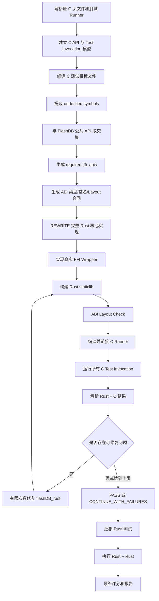

# FlashDB C-CROSS 交叉验证设计说明书（修订版）

> 文档状态：已确认  
> 适用项目：FlashDB C-to-Rust 比赛工程  
> 修订依据：C-CROSS 实际执行复盘及逐项方案确认  
> 核心目标：使用“完整 Rust 实现 + 原 C 测试”独立验证 Rust 源码，再执行“Rust 实现 + Rust 测试”

---

## 1. 文档目的

本文档用于指导开发 FlashDB C-to-Rust 工程中的 C-CROSS 交叉验证能力。

C-CROSS 的作用是：

```text
原 C 测试
    ↓
C ABI / FFI 适配层
    ↓
完整 Rust 实现
```

通过未经迁移的原 C 测试验证 Rust 实现，从而辅助判断：

- Rust 源码是否迁移错误；
- 迁移后的 Rust 测试是否编写错误。

工程最终保留两条验证链路：

```text
链路 A：完整 Rust 实现 + 原 C 测试
链路 B：完整 Rust 实现 + 迁移后的 Rust 测试
```

不建设：

```text
C 实现 + C 测试
C 实现 + Rust 测试
```

---

## 2. 已确认的最高优先级原则

### 2.1 REWRITE 必须生成完整 Rust 实现

`REWRITE_CORE_MODULES` 阶段的交付物必须是完整、真实的 Rust 实现，不是仅能编译的骨架或简化替代实现。

必须实现原工程要求的核心语义，包括但不限于：

- KVDB；
- TSDB；
- Flash/sector 管理；
- GC；
- 状态管理；
- iterator；
- 错误处理；
- 数据持久化语义；
- C-CROSS 所需的真实 FFI wrapper。

以下实现不允许被视为 REWRITE 完成：

- 用 HashMap 替代原本必须保留的 sector/GC 语义；
- `todo!()`；
- `unimplemented!()`；
- 固定成功返回值；
- 空函数；
- 仅为通过编译提供的 stub；
- 跳过原 C 核心行为的简化实现。

### 2.2 C-CROSS 只负责验证

C-CROSS 不负责补写业务逻辑，也不负责决定哪些原功能可以省略。

其职责是：

1. 构建 Rust staticlib；
2. 检查 C ABI 布局；
3. 编译并链接原 C runner；
4. 运行所有原 C 测试 invocation；
5. 解析测试结果；
6. 记录失败原因；
7. 将可修复问题回派给 Rust 实现 Agent；
8. 达到修复上限后记录 unresolved；
9. 无论是否完全通过，都继续比赛后续流程。

### 2.3 比赛流水线不得中途终止

所有阶段均采用软 Gate。

阶段结果只有：

```text
PASS
CONTINUE_WITH_FAILURES
```

不得因为以下问题终止整个比赛流程：

- Rust 编译失败；
- ABI layout 失败；
- C runner 编译或链接失败；
- C runner timeout；
- C 测试失败；
- runner 结果解析失败；
- 工具链故障；
- 自动修复达到上限。

失败必须被真实记录，但后续 Rust 测试迁移、Rust 测试执行、评分和最终报告仍要继续尝试执行。

---

## 3. 结果解释

| Rust + C | Rust + Rust | 主要判断 |
|---|---|---|
| 通过 | 通过 | 当前原 C 测试覆盖范围内，Rust 实现和 Rust 测试均正常 |
| 通过 | 失败 | 优先检查 Rust 测试迁移 |
| 失败 | 失败 | 优先检查 Rust 实现或 FFI 适配 |
| 失败 | 通过 | 优先检查 FFI、C 测试与 Rust 测试覆盖差异 |
| 未完成/不可解析 | 任意 | C-CROSS 证据不足，记录 unresolved，不得伪装为通过 |

注意：

> Rust + C 通过只能说明 Rust 实现在原 C 测试覆盖范围内符合预期，不能证明 Rust 实现绝对正确。

---

## 4. 总体流程



---

## 5. 原 C 测试范围

### 5.1 所有 Runner 注册的测试都进入 C-CROSS

不再设计：

```text
c_cross.enabled
enabled / disabled
测试排除开关
```

原 C runner 中注册的所有测试 invocation 均进入 C-CROSS，包括：

- KVDB 测试；
- TSDB 测试；
- GC；
- GC2；
- scale-up；
- iterator；
- status；
- 同一 C 测试函数的重复调用。

### 5.2 不允许通过排除测试规避失败

如果某个 C 测试失败，应记录真实原因，例如：

```text
rust_semantic_mismatch
ffi_symbol_missing
abi_layout_mismatch
c_runner_build_failed
c_runner_runtime_failed
runtime_timeout
c_cross_result_parse_failed
toolchain_defect
```

不得因为当前 Rust 实现不支持某项行为，就将对应测试排除。

例如：

> `test_fdb_gc`、`test_fdb_gc2`、`test_fdb_scale_up` 失败，说明 Rust 实现缺少原 FlashDB 的 GC、sector 或地址管理语义；不能据此认定这些测试不应进入 C-CROSS。

---

## 6. Test Invocation 建模

### 6.1 问题背景

同一个 C 测试函数可能被 `TEST_RUN` 多次调用。

例如：

```text
Running: test_fdb_tsl_clean
Running: test_fdb_tsl_clean
```

测试函数名不能作为执行实例的唯一标识。

### 6.2 唯一标识

一次测试执行实例由以下字段确定：

```text
suite
+ runner
+ test_function
+ invocation_index
```

### 6.3 `registered_test_invocations` 数据结构

```json
{
  "suite": "tsdb",
  "runner": "tests/tsdb_main.c",
  "test_function": "test_fdb_tsl_clean",
  "invocation_index": 1,
  "runner_order": 15,
  "scenario_id": "test_fdb_tsl_clean",
  "source_file": "tests/fdb_tsdb_tc.c",
  "source_line": 501
}
```

第二次调用：

```json
{
  "suite": "tsdb",
  "runner": "tests/tsdb_main.c",
  "test_function": "test_fdb_tsl_clean",
  "invocation_index": 2,
  "runner_order": 21,
  "scenario_id": "test_fdb_tsl_clean__2",
  "source_file": "tests/fdb_tsdb_tc.c",
  "source_line": 507
}
```

### 6.4 字段职责

| 字段 | 含义 |
|---|---|
| `source_line` | `TEST_RUN` 在 C 源码中的行号 |
| `runner_order` | 在 runner 中的执行顺序 |
| `invocation_index` | 同名测试函数的第几次调用 |
| `scenario_id` | 工具链内部使用的唯一场景 ID |
| `test_function` | runner 实际输出的 C 函数名 |

不得继续使用单个 `source_index` 混合表示上述概念。

---

## 7. C API 事实模型

### 7.1 公共 API 来源

从 FlashDB 对外头文件提取公共 API，例如：

```text
inc/flashdb.h
inc/fdb_def.h
```

生成 `c_api_model.json`。

### 7.2 必须提取的事实

```json
{
  "function_signatures": {},
  "typedef_map": {},
  "enum_map": {},
  "public_api_symbols": [],
  "unresolved_signatures": []
}
```

### 7.3 约束

- FFI Agent 不得猜测 C 函数签名；
- typedef、enum、指针 constness、回调签名必须来自模型；
- `unresolved_signatures` 必须显式记录；
- 函数签名事实错误属于 ABI 合同问题，不得由实现 Agent自行改写。

---

## 8. C-CROSS 所需 FFI 函数推导

### 8.1 推导原则

不通过 LLM 分析完整源码调用链，也不人工维护 FFI 函数列表。

采用真实链接需求推导：

```text
C 测试目标文件的 undefined symbols
∩
FlashDB 公共 API 集合
=
required_ffi_apis
```

### 8.2 实现流程

1. 编译原 C runner、测试文件和测试 helper 为 `.o`；
2. 不链接原 FlashDB C 实现；
3. 对测试目标文件进行部分链接；
4. 提取剩余未解析符号；
5. 与 `c_api_model.json.public_api_symbols` 取交集；
6. 生成 `ffi_manifest.json`。

示例：

```bash
gcc -c tests/kvdb_main.c -o kvdb_main.o
gcc -c tests/fdb_kvdb_tc.c -o fdb_kvdb_tc.o
ld -r kvdb_main.o fdb_kvdb_tc.o -o kvdb_tests_combined.o
nm -u kvdb_tests_combined.o
```

根据平台可使用等价工具：

```text
nm
llvm-nm
readelf
```

### 8.3 过滤效果

目标文件中可能存在：

```text
fdb_kvdb_init
fdb_kv_set
fdb_kv_get
memset
printf
strlen
```

与 FlashDB 公共 API 取交集后得到：

```text
fdb_kvdb_init
fdb_kv_set
fdb_kv_get
```

C 标准库和测试框架符号不会进入 Rust FFI 清单。

### 8.4 间接调用

只要测试 helper 最终引用了 FlashDB 外部符号，部分链接后的 undefined symbol 中仍会保留该符号，因此无需构建完整 C 调用图。

### 8.5 `ffi_manifest.json`

第一版只记录所需函数：

```json
{
  "required_ffi_apis": [
    "fdb_kvdb_init",
    "fdb_kvdb_deinit",
    "fdb_kv_set",
    "fdb_kv_get",
    "fdb_kv_del"
  ]
}
```

ABI 类型继续沿用当前 `c_abi_facade.structs`，暂不增加复杂的类型最小化分析。

---

## 9. C ABI Facade 设计

### 9.1 范围

C ABI facade 包含：

- `c_abi_facade.structs`；
- C 函数签名；
- `c_type_map`；
- C 符号与 Rust wrapper 的映射；
- layout probe。

函数范围以 `required_ffi_apis` 为准。

ABI 类型继续使用现有 `c_abi_facade.structs`，不额外扫描每个测试的最小类型依赖。

### 9.2 使用 `#[repr(C)]`

保留 `#[repr(C)]` C ABI facade，不采用 opaque handle。

原因：

- 原 C 测试直接声明 C 结构体；
- 原 C 测试可能直接读取嵌套字段；
- 不修改原 C 测试；
- 不生成大量 observation getter。

示例：

```rust
#[repr(C)]
pub struct FdbDb {
    pub oldest_addr: u32,
    // 其他 ABI 合同字段
}

#[repr(C)]
pub struct FdbKvdb {
    pub parent: FdbDb,
    // 其他 ABI 合同字段
}
```

### 9.3 Rust 内部结构

`#[repr(C)]` facade 不要求 Rust 核心内部结构完全使用相同设计。

Rust 核心可保持独立实现，但 FFI facade 中暴露的状态必须来自真实 Rust 实现，不能伪造。

### 9.4 不使用 Observation API

删除以下设计：

```text
c_cross_get_oldest_addr
c_cross_get_sector_count
selective observation API
```

原 C 测试通过 `#[repr(C)]` facade 的兼容字段访问状态。

### 9.5 Layout Check

Layout Check 检查已有 `c_abi_facade.structs`：

- `sizeof`；
- `alignof`；
- 字段 offset；
- enum 值；
- 错误码常量。

---

## 10. FFI 目录与构建方式

### 10.1 目录

沿用现有目录：

```text
flashDB_rust/
└── src/
    └── ffi/
        ├── c_types.rs
        ├── kvdb.rs
        ├── tsdb.rs
        └── mod.rs
```

不重命名为：

```text
src/c_cross_ffi/
```

不拆分独立 FFI crate。

### 10.2 Cargo 配置

FFI 默认参与 staticlib 构建，不增加 `c-cross-ffi` Cargo feature。

```toml
[lib]
crate-type = ["rlib", "staticlib"]
```

构建命令保持：

```bash
cargo build --release
```

不得要求：

```bash
cargo build --release --features c-cross-ffi
```

---

## 11. 骨架阶段与 REWRITE 阶段职责

### 11.1 骨架阶段

骨架阶段只生成 ABI 合同，不生成可执行 wrapper 函数体。

生成：

1. `#[repr(C)]` 类型；
2. enum、常量和错误码映射；
3. 所需函数的准确 C 签名；
4. symbol mapping；
5. layout probe；
6. `ffi_manifest.json`。

禁止生成：

- 固定返回成功的 wrapper；
- 空 wrapper；
- `todo!()` wrapper；
- `unimplemented!()` wrapper；
- mock/stub；
- 临时业务逻辑。

### 11.2 REWRITE 阶段

REWRITE 阶段按顺序完成：

```text
1. 完整实现 Rust 核心业务
2. 根据 ABI 合同实现真实 FFI wrapper
```

真实 wrapper 必须：

- 校验必要的 C 参数；
- 完成类型转换；
- 调用真实 Rust 核心函数；
- 映射真实返回值和错误码；
- 不重复实现核心业务逻辑。

示例：

```rust
#[no_mangle]
pub unsafe extern "C" fn fdb_kv_del(
    db: *mut FdbKvdb,
    key: *const c_char,
) -> i32 {
    // 参数和类型转换
    // 调用真实 Rust 核心实现
    // 返回真实错误码
}
```

### 11.3 ABI 合同修改规则

实现阶段不得自行修改：

- C 函数名；
- 参数数量；
- 参数类型；
- 返回类型；
- C 类型布局；
- enum 值；
- 错误码值。

只有发现 ABI 合同与原 C 头文件事实不一致时，才记录 `design-gaps.jsonl` 并回派合同阶段修正。

不能因为 Rust 实现困难而修改 C ABI。

---

## 12. Runner 与结果 Parser

### 12.1 使用原 Runner 格式

Parser 以原 FlashDB runner 的实际输出为准：

```text
Running: test_fdb_tsl_set_status ...
FAIL test_fdb_tsl_set_status: assertion text
```

不要求修改成：

```text
[ RUN      ]
[       OK ]
```

### 12.2 重复 Invocation 匹配

Parser 对同名 `Running:` 按出现顺序映射：

```text
第 1 次 Running: test_fdb_tsl_clean
→ invocation_index = 1
→ scenario_id = test_fdb_tsl_clean

第 2 次 Running: test_fdb_tsl_clean
→ invocation_index = 2
→ scenario_id = test_fdb_tsl_clean__2
```

不得因为出现 duplicate start 直接将整个 suite 标记为 `parse_failed`。

### 12.3 Pass/Fail 解析

在原 runner 没有显式 `OK` 行的前提下：

- 识别每个 `Running:` 作为 invocation 开始；
- 将后续对应 `FAIL test_name:` 关联到当前 invocation；
- 未出现对应 FAIL 且 runner 正常结束的 invocation 记为 pass；
- runner 中断、输出不完整或无法建立 invocation 映射时，记为 `parse_failed`；
- `parse_failed` 不等于测试失败，也不等于测试通过。

---

## 13. `c_cross_validate.py` 执行流程

```text
1. 读取 C API 模型和 Test Invocation 模型
2. 生成 required_ffi_apis
3. 校验 ABI 合同和 FFI wrapper 完整性
4. cargo build --release
5. ABI Layout Check
6. 编译 C runner 并链接 Rust staticlib
7. 创建 suite 独立运行目录
8. 运行 kvdb runner 和 tsdb runner
9. 应用固定 timeout
10. 解析 runner 输出
11. 生成 validation-matrix.json
12. 生成 diagnostics.jsonl
13. 记录简单 attempts.jsonl
14. 生成阶段结果 PASS 或 CONTINUE_WITH_FAILURES
```

---

## 14. Timeout、运行目录与日志

### 14.1 Timeout

C runner 必须设置固定超时，第一版建议 60 秒。

超时返回：

```text
exit_code = -124
diagnosis = runtime_timeout
```

第一版不增加复杂 CLI。

### 14.2 Suite 独立目录

```text
c_cross/runs/kvdb/
c_cross/runs/tsdb/
```

每次执行前清理对应目录。

作用：

- 防止上一次运行残留；
- 防止 KVDB 和 TSDB 数据互相污染；
- 固定日志和运行数据位置。

### 14.3 日志

```text
c_cross/logs/kvdb_runner.log
c_cross/logs/tsdb_runner.log
```

必须保存：

- 完整 stdout/stderr；
- runner 返回码；
- timeout 标识；
- 最后一个 `Running:` 测试；
- Parser 错误原因。

---

## 15. Diagnostics 与 Handoff

### 15.1 Diagnostics

`diagnostics.jsonl` 回答：

```text
出了什么问题？
为什么这么判断？
证据在哪里？
```

每个失败或解析失败 scenario 必须有独立条目。

示例：

```json
{
  "scenario_id": "test_fdb_tsl_clean__2",
  "suite": "tsdb",
  "diagnosis": "c_cross_result_parse_failed",
  "reason": "second invocation could not be mapped",
  "evidence": "c_cross/logs/tsdb_runner.log"
}
```

### 15.2 Handoff

`handoff` 回答：

```text
这个问题应交给哪个 Agent 处理？
```

最低映射要求：

| Diagnosis | Handoff |
|---|---|
| `c_cross_result_parse_failed` | `c-analyzer` |
| `toolchain_defect` | `c-analyzer` |
| Rust 语义失败 | `rust-implementer` |
| FFI/ABI 产物问题 | `rust-implementer` 或工程内指定 FFI Agent |

所有合法 diagnosis 都必须有明确映射，不允许合法失败默认返回 `"none"`。

### 15.3 作用边界

Diagnostics 和 handoff 表示：

- 问题已识别；
- 责任路径已明确。

它们不表示：

- 问题已经解决；
- C-CROSS 已经通过。

---

## 16. 软 Gate 合同

### 16.1 阶段结果

`VERIFY_RUST_WITH_C_TESTS` 只输出：

```text
PASS
CONTINUE_WITH_FAILURES
```

### 16.2 PASS

满足：

- Rust staticlib 构建成功；
- ABI Layout Check 成功；
- C runner 构建和链接成功；
- runner 结果可解析；
- 所有 C 测试 invocation 通过。

### 16.3 CONTINUE_WITH_FAILURES

以下任一情况产生：

- Rust 构建失败；
- ABI layout 失败；
- C runner 编译或链接失败；
- runtime timeout；
- C 测试失败；
- result parse_failed；
- 工具链故障；
- 修复达到上限仍未解决。

### 16.4 放行规则

无论阶段结果是 PASS 还是 CONTINUE_WITH_FAILURES，都进入：

```text
MIGRATE_TESTS
VERIFY_RUST_WITH_RUST_TESTS
SCORING
FINAL_REPORT
```

失败必须保留为 unresolved，不能标记为 pass。

---

## 17. 自动修复策略

### 17.1 可修复的参赛产物问题

只有能通过修改 `flashDB_rust/**` 解决的问题进入有限次数自动修复，例如：

- Rust 语义错误；
- FFI 符号缺失；
- FFI wrapper 错误；
- Rust 侧 ABI 类型错误；
- Rust 编译错误；
- C runner 因 Rust staticlib 导出问题链接失败。

建议固定最大修复次数，例如 3 次。

达到上限仍失败：

```text
status = unresolved
stage = CONTINUE_WITH_FAILURES
```

### 17.2 工具链问题

以下问题不进行重复修复：

- Parser 不能处理 runner 输出；
- Test Invocation 模型生成错误；
- Gate contract 错误；
- `c_cross_validate.py` 内部异常；
- `build_c_model.py` 工具错误；
- 其他必须修改 `work/**` 才能解决的问题。

处理方式：

```text
diagnosis = toolchain_defect
handoff = c-analyzer
写入 workbench-issues.jsonl
相关 scenario 标记 unresolved
CONTINUE_WITH_FAILURES
```

不得重复运行三次相同工具并期待不同结果。

---

## 18. 工具产物与写入权限

### 18.1 工具自动生成

以下文件必须由工具生成：

```text
validation-matrix.json
diagnostics.jsonl
attempts.jsonl
workbench-issues.jsonl
```

Subagent 不得手工修改这些文件。

### 18.2 删除复杂 Deferred 机制

删除：

```text
deferred.jsonl
failure fingerprint
no_progress_count
attempt_ids 交叉引用
deferred evidence gate
```

### 18.3 简单 Attempts

`attempts.jsonl` 只记录简单修复历史：

```json
{
  "attempt": 2,
  "stage": "VERIFY_RUST_WITH_C_TESTS",
  "scenario_id": "test_fdb_gc",
  "changed_files": [
    "flashDB_rust/src/kvdb.rs"
  ],
  "result": "fail"
}
```

`changed_files` 用于追踪，不再作为复杂 deferred 放行证据。

---

## 19. `work/**` 只读规则

### 19.1 比赛运行阶段

比赛运行 Agent 不得修改：

```text
work/**
```

包括：

- `c_cross_validate.py`；
- `gate.py`；
- `build_c_model.py`；
- Tool contract；
- Skill 定义；
- 验证规则。

### 19.2 工具链故障

发现工具链故障后：

1. 写入 `workbench-issues.jsonl`；
2. 记录工具、原因、证据和受影响场景；
3. 标记相关场景 unresolved；
4. 阶段结果为 `CONTINUE_WITH_FAILURES`；
5. 继续比赛流程。

示例：

```json
{
  "stage": "VERIFY_RUST_WITH_C_TESTS",
  "type": "toolchain_defect",
  "tool": "c_cross_validate.py",
  "reason": "duplicate invocation mapping failed",
  "evidence": "c_cross/logs/tsdb_runner.log",
  "affected_scenarios": [
    "test_fdb_tsl_clean",
    "test_fdb_tsl_clean__2"
  ],
  "status": "unresolved"
}
```

禁止通过修改 Gate 或 Parser 绕过当前比赛失败。

---

## 20. 核心输出文件

### 20.1 `c_test_model.json`

重点字段：

```json
{
  "registered_test_invocations": [
    {
      "suite": "tsdb",
      "runner": "tests/tsdb_main.c",
      "test_function": "test_fdb_tsl_clean",
      "invocation_index": 2,
      "runner_order": 21,
      "scenario_id": "test_fdb_tsl_clean__2",
      "source_file": "tests/fdb_tsdb_tc.c",
      "source_line": 507
    }
  ]
}
```

### 20.2 `c_api_model.json`

```json
{
  "function_signatures": {},
  "typedef_map": {},
  "enum_map": {},
  "public_api_symbols": [],
  "unresolved_signatures": []
}
```

### 20.3 `ffi_manifest.json`

```json
{
  "required_ffi_apis": [
    "fdb_kvdb_init",
    "fdb_kvdb_deinit",
    "fdb_kv_set",
    "fdb_kv_get"
  ]
}
```

### 20.4 `validation-matrix.json`

场景状态可包含：

```text
pass
fail
parse_failed
unresolved
```

阶段聚合结果仅为：

```text
PASS
CONTINUE_WITH_FAILURES
```

### 20.5 `diagnostics.jsonl`

每个失败场景一条记录，包含：

```text
scenario_id
suite
diagnosis
handoff
reason
evidence
```

### 20.6 `attempts.jsonl`

只记录简单的自动修复历史。

### 20.7 `workbench-issues.jsonl`

只记录运行阶段无法修改的工具链问题。

---

## 21. Subagent 职责同步

需要同步更新：

- orchestrator；
- rust-implementer；
- c-analyzer；
- test-migrator；
- repairer；
- 其他 FFI/ABI 相关 Skill。

必须明确：

1. REWRITE 生成完整 Rust 实现；
2. 所有原 C 测试都进入 C-CROSS；
3. 不得通过排除测试规避失败；
4. 骨架阶段不生成 wrapper 函数体；
5. REWRITE 阶段实现真实 wrapper；
6. wrapper 必须调用真实 Rust 实现；
7. 工具结果文件不得手工编辑；
8. 参赛产物问题有限修复；
9. 工具链问题直接登记，不重复修复；
10. 所有阶段不得终止比赛总流程；
11. unresolved 必须进入最终报告。

---

## 22. 开发任务拆分

### P0：修复当前真实结果解析

1. `registered_test_invocations` 增加：
   - `suite`
   - `runner`
   - `test_function`
   - `invocation_index`
   - `runner_order`
   - `scenario_id`
   - `source_line`
2. Parser 按 invocation 顺序映射重复 `Running:`；
3. 增加：
   ```text
   c_cross_result_parse_failed → c-analyzer
   ```
4. 为每个失败场景生成 diagnostics；
5. Runner Parser 使用实际 `Running:` / `FAIL` 格式。

预期恢复真实结果：

```text
KVDB：11 pass + 3 fail
TSDB：9 pass + 2 fail
```

而不是把全部 TSDB 场景标记为 parse_failed。

### P1：简化 Gate 和状态产物

1. Gate 改为 PASS / CONTINUE_WITH_FAILURES；
2. 删除 deferred；
3. 简化 attempts；
4. unresolved 自动生成；
5. 所有阶段继续执行。

### P2：建立 FFI 函数事实链

1. 提取 C API 签名；
2. 编译 C 测试目标文件；
3. 部分链接；
4. 提取 undefined symbols；
5. 与公共 API 取交集；
6. 生成 `ffi_manifest.json`。

### P3：规范 ABI 与 REWRITE

1. 骨架阶段只生成 ABI 合同；
2. REWRITE 完整实现 Rust；
3. REWRITE 实现真实 FFI wrapper；
4. 保留 `#[repr(C)]` facade；
5. 不使用 opaque handle；
6. 不使用 observation API；
7. 不增加 Cargo feature；
8. 沿用 `src/ffi/`。

### P4：同步文档与 Skill

1. 更新所有相关 Skill；
2. 更新 Tool contract；
3. 增加 diagnosis → handoff 完整性检查；
4. 增加模型和 Parser 单元测试。

---

## 23. 验收标准

### 23.1 Test Invocation

- 同名 C 测试函数重复执行时，能够正确映射每次 invocation；
- `test_fdb_tsl_clean__2` 能对应第二次真实 `Running: test_fdb_tsl_clean`；
- 不再因为 duplicate start 将整个 suite 标记 parse_failed。

### 23.2 FFI

- `required_ffi_apis` 来自真实 undefined symbols；
- FFI wrapper 调用真实 Rust 核心函数；
- 不存在 stub、固定成功值或空实现；
- FFI 默认参与 staticlib 构建；
- 使用现有 `src/ffi/`；
- 不使用 observation API。

### 23.3 Rust 完整性

- REWRITE 的目标是完整迁移；
- HashMap 等简化替代实现若缺少原语义，必须被视为实现缺陷；
- GC、GC2、scale-up 等测试不得被排除。

### 23.4 Gate

- 任意失败不得终止比赛总流程；
- 阶段结果只为 PASS 或 CONTINUE_WITH_FAILURES；
- unresolved 不得伪装为通过；
- Rust 测试迁移、执行和评分始终继续尝试。

### 23.5 工具结果

- validation matrix、diagnostics、attempts 由工具生成；
- 不存在 deferred.jsonl；
- 工具链问题进入 workbench-issues；
- 比赛 Agent 不修改 `work/**`。

---

## 24. 最终目录建议

```text
flashDB_rust/
├── Cargo.toml
├── src/
│   ├── lib.rs
│   ├── kvdb/
│   ├── tsdb/
│   └── ffi/
│       ├── mod.rs
│       ├── c_types.rs
│       ├── kvdb.rs
│       └── tsdb.rs
├── tests/
└── c_cross/
    ├── c_cross_validate.py
    ├── ffi_manifest.json
    ├── kvdb_main.c
    ├── tsdb_main.c
    ├── runs/
    │   ├── kvdb/
    │   └── tsdb/
    └── logs/
        ├── kvdb_runner.log
        └── tsdb_runner.log
```

工具链产物路径按现有工程实际位置保持，不强制为了本设计进行无收益的目录重构。

---

## 25. 相对原方案的关键修订

1. 删除 C 测试筛选和 `c_cross.enabled`；
2. 所有 runner invocation 都执行；
3. GC、GC2、scale-up 不排除；
4. FFI 函数由 undefined symbols 与公共 API 交集推导；
5. ABI 类型继续使用现有 facade，不做复杂最小化分析；
6. 保留 `#[repr(C)]`，不采用 opaque handle；
7. 删除 observation API；
8. 骨架阶段不生成 wrapper 函数体；
9. REWRITE 负责完整 Rust 和真实 wrapper；
10. 删除 `c-cross-ffi` feature；
11. 沿用 `src/ffi/`；
12. Gate 改成永不终止的软 Gate；
13. 删除 deferred、fingerprint 和复杂收敛机制；
14. 工具产物禁止手写；
15. 工具链问题不重复修复，直接登记并继续；
16. `work/**` 在比赛运行阶段保持只读；
17. Parser 正确支持同名测试多次 invocation；
18. Diagnostics 和 handoff 只用于问题识别与分派，不代表问题已解决。

---

## 26. 最终结论

C-CROSS 的总体方向保持不变：

> 使用原 C 测试独立验证完整 Rust 实现，再用迁移后的 Rust 测试验证最终 Rust 工程。

修订后的方案坚持三个核心要求：

1. **完整性**：REWRITE 必须交付完整 Rust 实现，不能使用简化实现规避原语义；
2. **真实性**：所有原 C 测试均执行，所有失败均保留，FFI 必须调用真实 Rust 实现；
3. **完赛性**：任何中间错误都不能终止比赛流水线，未解决问题以 `CONTINUE_WITH_FAILURES` 和 unresolved 形式带入最终报告。
