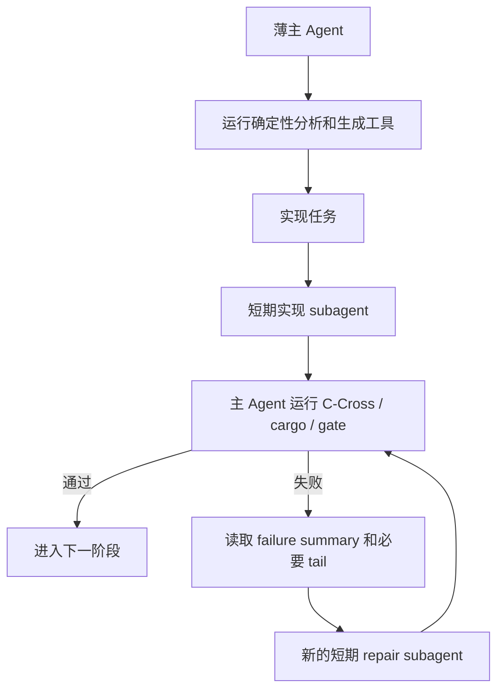

# Q11 - OpenCode 上下文爆炸分析与优化方案

> 分析对象：2026-07-15 从 `/home/nv_test/c2rust` 启动、执行 `02_02` 转换工程的 OpenCode 运行  
> 分析快照：2026-07-15 20:58（Asia/Shanghai）  
> 文档状态：已批准实施 P0 上下文边界与自动短 session 接力；不依赖 compact、插件、人工 continuation 或新的 primary session

## 1. 结论

本次故障不是“subagent 数量太多”或“递归层级太深”导致的。

本次 7 个 subagent 全部是主 Agent 的直接子会话，没有递归创建；第六个仍然因为在一个 session 中连续承担源码读取、实现、验证、崩溃排查和再次修复而达到 GLM-5.1 的输入上限。限制递归不能解决本次问题。

正确方向是：

1. 主 Agent 保持轻量，只负责阶段推进、运行确定性工具、验证共享工作区和生成最终报告；
2. 允许按实际失败数量启动多个短生命周期 subagent，不设置固定总数上限；
3. 每个 subagent 只处理一个边界明确的工作单元，完成一次修改后立即退出；
4. 新 session 通过工作区文件、最新 failure summary 和短交接继续，不继承旧 session 的全部对话；
5. 所有接力均由 primary Agent 在同一次无人值守运行内自动创建 subagent 完成；不依赖用户第二次输入、人工 continuation 或新的 primary session。

因此，目标执行模型不是“单 Agent”或“限制只能启动一个 subagent”，而是：

```text
薄主 Agent + 多个短期、边界明确且自动接力的 subagent
```

## 2. 证据范围与口径

本次分析只读取以下本地证据，没有中断或修改仍在运行的 OpenCode 任务：

- OpenCode 进程与工作目录；
- `~/.local/share/opencode/opencode.db` 中的 session、message、part 和 event；
- OpenCode 1.17.20 的已安装插件与 SDK 类型；
- 当前解析后的自定义模型配置结构；
- `02_02/INSTRUCTION.md` 与 `02_02/work/skills/*.md`；
- 本次主 Agent 和 7 个 subagent 的真实 task prompt、工具调用和输出规模。

需要区分两个 token 指标：

- session 表中的 `tokens_input` 是多次请求的累计输入量，不能代表当前上下文窗口；
- 每条 assistant message 的 `tokens.total` 才能近似表示该次模型请求实际携带的上下文规模。

第六个 subagent 的 `tokens_input = 1,209,998` 是累计量；导致失败的最后一次有效请求为 `202,669 tokens`。

## 3. 本次运行拓扑

主 session：

```text
ses_09cace0c0ffeGXzmmMIuxJrUAD
标题：读取并执行02_02指令
Agent：build
```

7 个直接子 session：

| 序号 | 标题 | 最后/最大上下文 | 状态 | 风险 |
|---:|---|---:|---|---|
| 1 | Read FlashDB C source files | 25,222 | 已完成 | 低 |
| 2 | Read FlashDB kvdb/tsdb C source | 50,679 | 已完成 | 低 |
| 3 | Read FlashDB test files | 27,958 | 已完成 | 低 |
| 4 | Implement Rust core modules | 90,375 | 已完成 | 中 |
| 5 | Implement full Rust FFI modules | 175,930 | 已完成 | 若恢复则极高 |
| 6 | Fix GC sector allocation logic | 202,669 | APIError 失败 | 已触顶 |
| 7 | Fix GC sector allocation | 160,024 | 仍在运行 | 高 |
| 主 Agent | 读取并执行02_02指令 | 157,788 | 等待第七个 task | 高 |

GLM-5.1 本次由服务端返回的输入上限为 `202,745`。第六个在失败前已使用：

```text
202,669 / 202,745 = 99.96%
```

## 4. 问题一：第六个 subagent 在做什么，为什么爆

### 4.1 原始任务

第六个 subagent 负责修复剩余两个 GC 场景：

- `test_fdb_gc`；
- `test_fdb_gc2`。

主要目标是修正：

- sector 空间搜索顺序；
- dirty sector 选择；
- GC 搬移与格式化；
- KV 实际写入 sector；
- `oldest_addr` 更新。

允许修改的核心文件实际集中在：

- `flashDB_rust/src/storage.rs`；
- `flashDB_rust/src/kvdb.rs`。

这本应是一个边界明确的修复任务。

### 4.2 实际执行规模

第六个 session 共出现 88 个 assistant step、95 次工具调用：

| 工具 | 调用次数 | 返回内容规模 |
|---|---:|---:|
| `skill` | 1 | 17,323 字符 |
| `read` | 26 | 215,131 字符 |
| `grep` | 12 | 6,592 字符 |
| `edit` | 11 | 260 字符 |
| `bash` | 45 | 27,878 字符 |

它还加载了与本次实现修复无关的 `c-to-rust-scoring` Skill，单次引入 17,323 字符。

重复读取包括：

- `storage.rs` 多次大窗口读取；
- `kvdb.rs`；
- GC 测试函数多个重叠窗口；
- `fdb_kvdb.c` 多个重叠窗口；
- 多轮 C-Cross、runner 日志和调试输出。

后期任务从“修复 GC sector allocation”扩展到了：

- runner 崩溃；
- segfault；
- iterator/FFI 行为；
- standalone runner 与 gdb 调试；
- 多轮验证和再次修改。

### 4.3 直接失败

最后一次有效上下文达到 `202,669` 后，下一次请求收到：

```text
litellm.BadRequestError: DashscopeException
Range of input length should be [1, 202745]
Model Group=GLM-5.1
```

OpenCode 将其记录为：

```text
name: APIError
statusCode: 400
isRetryable: false
```

因此，第六个不是被某个单独的大文件瞬间打爆，而是在同一 session 中不断累积源码、工具结果、修改、验证和调试历史，最终达到硬上限。

### 4.4 根因

根因可以归纳为：

```text
任务虽然被分派给 subagent，但没有把一次修复限制为一个短生命周期工作单元。
```

具体包括：

1. dispatch prompt 本身长达 8,937 字符，预先重复写入大量 GC 分析和实现方案；
2. 没有“完成一次最小补丁后立即返回”的停止条件；
3. subagent 自己承担了实现、验证、失败分析和下一轮修复；
4. 没有在验证失败后切换到新 session；
5. 没有工具输出或上下文压缩兜底；
6. 实际使用的是内置 `general` subagent，不是受当前工程合同约束的 `rust-implementer` 或 `repairer`。

## 5. 问题二：其他 subagent 和主 Agent 的风险

### 5.1 第七个 subagent

第七个是第六个失败后的 GC 接力 session，但正在复制同一种风险模式。

截至快照时：

- 当前上下文 `160,024`，约占已知上限的 `78.9%`；
- 13 次 read，返回约 150,242 字符；
- 56 次 bash，返回约 66,451 字符；
- 7 次 glob；
- 6 次 edit；
- 已创建 `/tmp/test_kv.c`；
- 已查找和尝试使用 isolation 目录下的 standalone runner。

这同时违反了工程已有的三项规定：

1. 显式临时产物不得写入 `/tmp`；
2. `c_cross_validate.py` 是唯一 C runner 入口；
3. repair subagent 不负责运行 C-Cross 或自行形成成功结论。

即使第七个当前没有报错，只要继续几轮读取、编译和运行，就存在与第六个相同的触顶风险。

### 5.2 第五个 subagent

第五个最终上下文为 `175,930`，约占上限的 `86.8%`。它已经完成，因此不会自行继续增长；但如果恢复该 session 或继续交给它集成修复，很容易在下一轮触顶。

它的任务范围包括完整 FFI、KVDB、TSDB、公共模块、构建修复和阶段日志，本身就不是短任务。

### 5.3 主 Agent

主 Agent 当前上下文为 `157,788`，约占上限的 `77.8%`，而且后续还需要：

- 接收第七个 subagent 的结果；
- 运行验证；
- 迁移 Rust tests；
- 进行语义一致性审查；
- 生成最终报告；
- 运行最终 gate。

主 Agent 已直接读取约 377,822 字符，其中包括三份约 60 KB 的完整 JSON：

- `c_test_model.json`；
- `rust_api_design.json`；
- `c_api_model.json`。

这与当前合同中“大 JSON 是冷数据，只读必要片段”的要求相反。即使第七个返回内容很短，主 Agent 也没有足够余量安全完成剩余阶段。

### 5.4 subagent 数量不是风险指标

本次 7 个 subagent 全部是主 Agent 的直接子会话，没有递归 fan-out。由此可以确认：

- “限制递归深度”不能防止第六个触顶；
- “最多只能启动一个 subagent”会把更多源码、验证和修复历史压回主 Agent，风险更高；
- 单纯增加 subagent 数量也不能解决问题，因为重复读取、任务重叠和长 session 仍会浪费上下文。

应该限制的是每个 session 的工作单元，而不是全局 subagent 数量。

## 6. 本轮边界：不依赖 compact

评分平台是一次输入、无人交互的运行环境，且 OpenCode 版本、模型元数据和可加载扩展都不受提交工程控制。本轮不把 `/compact`、自动 summarize、项目插件、人工 continuation 或更换 primary session 作为恢复条件或验收条件。

本方案只依赖一次运行内已经存在的 task/subagent 能力：primary Agent 在一个有界 worker 返回后，根据真实共享工作区和最新验证结果自动创建新的 worker。若平台原生 compact 恰好可用，它只能是额外保护，不能改变工程是否可完成的结论。

## 7. 问题三：当前工程为什么没有拦住

当前工程合同实际上已经写了正确方向：

- 默认主 Agent，subagent 只用于短、边界明确的辅助任务；
- 项目 subagent 规则在 `work/skills/*.md`；
- 大 JSON 和历史日志是冷数据；
- C-Cross 失败时只读 failure summary、日志 tail 和相关源码窗口；
- subagent 不负责 C-Cross、cargo、gate 复跑或成功结论；
- 不得访问 `/tmp/**`；
- `c_cross_validate.py` 是唯一 runner 入口。

但本次真实运行与合同相反：

1. 7 个 task 全部指定 `subagent_type: general`；
2. 没有一个 task 要求 General 先读取对应的 `work/skills/{subagent}.md`；
3. 前三个 reader task 明确要求 `FULL content`、`do not summarize`；
4. 第四、第五个实现任务 prompt 分别达到 7,620 和 11,461 字符；
5. 第六个 prompt 达到 8,937 字符，并在 prompt 中重新编码完整 GC 方案；
6. 主 Agent 自己又重复读取大 JSON 和源码；
7. subagent 自己运行验证、standalone runner 和 `/tmp` 探针。

`work/skills/*.md` 是比赛工程内的权威合同，但本次 OpenCode 没有把这些文件注册成实际命名 subagent。于是 Markdown frontmatter 中的 permission 没有成为 General session 的工具层权限，只剩自然语言约束。可执行的 fallback 不是禁止 General，而是要求 General 的第一步完整读取对应权威 Markdown，之后只接收动态路径、失败和文件范围。

核心缺口不是“规则没写”，而是：

```text
调度行为没有稳定地引用并执行权威 subagent 合同。
```

## 8. 优化目标与非目标

### 8.1 目标

1. 不再出现单个 primary/subagent 因上下文耗尽而使工程直接停止；
2. 允许按任务需要启动多个 subagent；
3. 每个 subagent 都有明确输入、文件范围、修改次数和退出条件；
4. 主 Agent 不读取全文大模型产物和不必要源码；
5. subagent 失败后可由新 session 从共享工作区继续；
6. 不依赖 compact 也能通过自动 worker 轮换完成任务；
7. 不削弱真实 C-Cross、测试一致性、最终 gate 和失败报告要求。

### 8.2 非目标

本方案不做以下事情：

- 不设置“最多一个 subagent”或固定 subagent 总数；
- 不把禁止递归当成主要解法；
- 不新增 task queue、task packet、agent registry、receipt、controller 状态机；
- 不依赖修改评分平台的全局 OpenCode 配置；
- 不要求 subagent 自己精确计算剩余 token；
- 不让 subagent 自己判定阶段通过；
- 不通过删除测试、弱化断言或修改 gate 降低上下文压力。

## 9. 建议执行模型



### 9.1 主 Agent 职责

主 Agent 只负责：

- 运行工程工具；
- 读取短摘要和必要局部证据；
- 分派边界明确的实现或修复任务；
- 检查 subagent 实际写入；
- 运行 C-Cross、cargo、semantic review、consistency 和 gate；
- 根据最新失败决定是否启动新的 repair session；
- 生成最终报告。

主 Agent 不应：

- 让 reader subagent 返回源码全文；
- 自己全文读取大 JSON；
- 在 dispatch prompt 中重写 subagent 业务规则；
- 把全部实现或全部失败交给同一个长期 subagent；
- 在已经达到高风险上下文后继续承担新阶段。

### 9.2 subagent 工作单元

每个实现或 repair subagent 必须同时具备：

1. 权威 Skill 路径；
2. 当前动态失败或实现目标；
3. 明确允许读取的局部证据；
4. 明确允许修改的文件；
5. 一次修改后的退出条件。

建议最小 dispatch 形式：

```text
先完整读取并执行 work/skills/repairer.md。
动态任务：修复 failure-summary 中的 test_fdb_gc。
允许修改：flashDB_rust/src/storage.rs、flashDB_rust/src/kvdb.rs。
只读取该失败、日志尾部、对应 C test/helper 与 Rust 函数窗口。
完成一次最小修复后立即返回修改文件、根因和未解决点；不要运行 C-Cross、cargo、gate 或 standalone runner。
```

业务规则只保留在 `work/skills/{subagent}.md`。dispatch 只携带动态上下文，不再复制 4K–11K 的静态方案。

### 9.3 repair 轮换规则

建议 repair 流程：

1. 主 Agent 运行一次真实验证；
2. 从 `failure-summary.json` 选择一个可独立处理的 failure cluster；
3. 启动一个新的 repair subagent；
4. subagent 完成一次最小修改后退出；
5. 主 Agent 检查实际 diff 并复跑验证；
6. 若失败指纹变化或仍未解决，启动新的 repair session；
7. 新 session 只收到最新 failure summary、当前文件和上一次修改结果，不继承旧聊天历史。

这里不限制总共可以启动多少个 repair subagent。限制的是每个 session 只承担一次有界修复，防止单 session 无限增长。

### 9.4 并发与递归

允许多个 subagent 并行的条件：

- 文件所有权不重叠；
- 失败场景相互独立；
- 不会同时修改公共 ABI、共享 storage 或同一测试；
- 主 Agent 能在共享工作区验证各自写入。

涉及同一共享模块或同一失败链时应顺序接力，避免并发覆盖。

是否由 subagent 再创建下一级 subagent不是主要验收指标。只有下级任务同样满足独立文件范围和短生命周期时才有意义；否则多一层只会增加重复读取和交接。工程不需要全局禁止递归，但也不应把递归当作自动扩容手段。

## 10. 上下文输入边界

### 10.1 默认冷数据

以下内容默认不得全文进入 primary 或 repair session：

- `c_api_model.json`；
- `c_test_model.json`；
- `rust_api_design.json`；
- 历史 C-Cross 完整日志；
- 完整 C 源码树；
- 完整 C tests；
- 总设计文档；
- 历史评分报告。

必须先由确定性工具生成摘要，或使用 `rg` 定位后读取必要窗口。

### 10.2 修复输入

一次 repair 只允许读取：

- 当前 failure summary；
- 当前失败日志 tail；
- 失败 C test 函数；
- 该 test 直接调用且影响语义的 helper；
- 对应 Rust 函数；
- 本轮允许修改文件中的必要窗口。

如果发现问题跨出允许范围，subagent 应返回 `unresolved` 和需要扩展的文件，不得自行扩成全工程排障。

### 10.3 工具输出

工程文档应继续要求：

- 使用 `rg`、`sed` 或工具提供的过滤参数读取局部；
- 验证输出只看 failure summary 和日志 tail；
- 不使用 `cat` 输出大日志；
- 不要求 subagent 返回源码全文；
- subagent 自然语言交接只包含修改文件、根因、未解决点，不回传源码和完整日志。

## 11. 拟修改范围

本轮按最小范围修改：

1. `02_02/INSTRUCTION.md`
   - 明确“薄主 Agent + 多个短期 subagent”；
   - 明确不限制总数，限制单 session 工作单元；
   - 禁止全文 reader task；
   - 增加修复后换新 session 的规则。

2. `02_02/work/skills/flashdb-orchestrator.md`
   - dispatch 只提供动态上下文；
   - General fallback 必须先读取权威 subagent Markdown；
   - 主 Agent 统一验证；
   - 失败后使用新 repair session，不让旧 session 无限迭代。

3. `02_02/work/skills/rust-implementer.md`
   - 一次有界实现/修复后退出；
   - 禁止自行扩展为全工程调试；
   - 禁止运行 C-Cross、standalone runner 和 `/tmp` 探针。

4. `02_02/work/skills/repairer.md`
   - 一个 failure cluster、一次补丁、短交接；
   - 超出允许文件时返回 unresolved；
   - 不负责复跑和成功结论。

5. `02_02/tests/`
   - 检查合同中不再要求全文读取；
   - 检查 General fallback 必须引用权威 Skill；
   - 检查 subagent 不负责 runner/gate；
   - 检查不设置固定 subagent 总数；

当前比赛目录要求 subagent Markdown 继续放在 `work/skills/{subagent}.md`，本方案不新增 `work/agents/`。

## 12. 实施顺序

### P0：先修正执行模型

1. 修改主执行与 subagent 合同；
2. 删除“返回全文”“读完所有源码”“迭代直到全部通过”等无限任务表述；
3. 明确一次补丁后退出、主 Agent 验证、新 session 接力；
4. 增加合同回归测试。

### P1：重新运行并对比

新运行至少记录：

- primary 最大上下文；
- 每个 subagent 最大上下文；
- subagent 数量和每个任务职责；
- 是否出现 context overflow；
- 是否仍有全文读取、`/tmp` 或 standalone runner；
- C-Cross、测试一致性与最终 gate 的真实结果。

不能只以“没有爆上下文”作为成功；如果减少上下文导致实现或评分准确率下降，同样不算优化成功。

## 13. 验收标准

方案实施后应满足：

1. 不设置固定 subagent 总数上限；
2. 每个 subagent task 都引用权威 `work/skills/{subagent}.md`；
3. dispatch 不再复制完整业务规则或大段实现方案；
4. 不再出现要求返回 C/Rust 源码全文的 reader task；
5. repair subagent 不运行 C-Cross、cargo、gate、standalone runner；
6. repair subagent 不访问 `/tmp/**`、`/var/tmp/**`；
7. 每个 repair session 完成一次有界补丁后退出；
8. 主 Agent 只读取 failure summary、日志 tail 和局部源码窗口；
9. 工作流无需 compact、插件、人工 continuation 或新的 primary session，仍能通过自动新 worker 接力继续；
10. 最终 C-Cross、semantic review、consistency 和 gate 仍使用真实结果，不能通过流程简化伪造成功；
11. 对比运行的最终迁移质量和评分准确率不低于当前 q9 基线。
