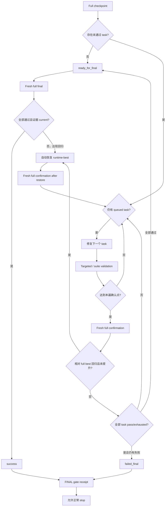

# Q15 - 转换准确度终态与回归自动恢复方案

> 状态：已实施；2026-07-17 已接入 scope fingerprint、C-Cross 自动回归恢复、测试 files-only 恢复、FINAL receipt 与 normal stop 门禁
>
> 日期：2026-07-17
>
> 范围：`02_02` 转换工程内部的逐任务修复、C-Cross 回归保护、Rust 测试回归保护、正常 FINAL 终态和 watchdog 正常停止条件。
>
> 明确不在范围内：评分平台的 run 目录复制、workspace 准备、评分项目搜索、跨 run 路径逃逸、CodeAgent session 恢复、平台进程管理。

## 1. 结论

540 分钟是比赛截止前的安全冻结点，不是转换必须运行到的目标时间。正常运行可以提前结束，但只能依据当前转换状态结束，不能依据运行时长、Agent 主观判断或“已经尝试过几次”结束。

正常结束必须同时满足：

1. 动态发现的全部转换任务均为 `confirmed_pass` 或 `exhausted`；
2. 当前生产源码、Rust tests、mapping 和验证证据属于同一个完整候选版本；
3. C-Cross 与 Rust tests 均完成 fresh full confirmation；
4. 当前候选没有低于已保存 best-known 的未处理回归；
5. `FINAL` gate 生成 current、可校验的成功 receipt；
6. watchdog 只在 receipt 有效时接受正常 `stop`。

因此本方案不要求“尽量跑满 540 分钟”，而是要求：

```text
还有可修任务              → 必须继续修复
任务已处理但缺全量确认    → 必须全量确认
当前版本发生无收益回归    → 自动恢复 best 并确认
全部通过                  → fresh final → success
全部剩余任务真实 exhausted → full confirmation → failed_final
FINAL receipt current     → 才允许正常停止
```

## 2. 本次运行暴露的问题

### 2.1 全量结果先提高后回退

运行记录中的 C-Cross score 语义为：

```text
[passed, -not_run, -failed, remaining_failure_depth]
```

可比较的全量结果曾从：

```text
[9, -7, -8, 68]
→ [14, 0, -10, 50]
→ [15, 0, -9, 45]
```

随后回退到：

```text
[13, -5, -6, 50]
```

最终结果不是“只剩 6 个失败”，而是 13 个通过、5 个未运行、6 个失败，共 11 个未通过。已经出现过的 15 个通过没有被恢复。

### 2.2 定向 repair 与全量结果被放在同一轮次表中

以下结果只覆盖单个定向场景：

```text
[0, 0, -1, 5]
```

它不能与 24 场景的全量结果比较，也不能：

- 更新全局 best；
- 判定整个工程回归；
- 证明某个未选场景仍然通过；
- 作为阶段终态确认。

当前 `c_cross_validate.py` 已经只在 full scope 下保存 runtime-best，但 scope 规则还没有成为所有 convergence、报告和终态入口共同验证的硬契约。

### 2.3 修复队列没有完成就进入 FINAL

本次记录只有 3 个 `repair` attempt。只要动态队列中仍有 `queued`、`active`、`deferred_no_progress`、`regressed` 或 `provisional_pass`，阶段就仍是 `repair_required`。

Agent 不能因为 FINAL 多次失败就推断“无法继续”。FINAL 失败只说明终态证据未成立，下一动作必须来自机器状态：

```text
repair_next_queued_task
run_full_confirmation
restore_best_and_confirm
run_fresh_final
```

### 2.4 watchdog stop 没有终态前置条件

当前 `contest_watchdog.py stop` 只向 watchdog 写入停止请求，不检查：

- FINAL gate 是否成功；
- queue 是否终结；
- 当前文件是否仍与最终验证一致；
- 报告是否对应 current evidence；
- 当前版本是否低于 best-known。

同时，`INSTRUCTION.md` 把 `gate FINAL` 和 `watchdog stop` 连续写在同一个命令块中，弱模型可能无视前一个命令的退出码继续 stop。

### 2.5 `attempt-kind final` 缺少前置状态限制

`final` 只应验证已经全量通过的候选。仍有失败时，合法失败终态是：

```text
所有失败 task exhausted
→ fresh full confirmation
→ failed_final
```

如果仍有失败时继续运行 `attempt-kind final`，它会重新写 validation matrix 和 convergence，既不能获得 success，也可能覆盖刚形成的 failed-final confirmation 证据。

## 3. 设计原则

### 3.1 状态优先，不以时间决定正常退出

- 540 分钟只承担 deadline freeze；
- 正常路径不等待 540 分钟；
- 正常路径也不能因为耗时较长、FINAL 重复失败或 Agent 认为困难而退出；
- 不引入新的全项目 repair 次数上限。

### 3.2 定向验证只更新局部任务状态

每条 attempt 必须记录：

```json
{
  "scope_kind": "targeted | suite | full",
  "scope_ids": [],
  "score_scope": "scenario-set fingerprint",
  "attempt_kind": "checkpoint | repair | confirmation | final"
}
```

只有 `scope_kind=full` 且动态场景集合 fingerprint 相同的结果才能：

- 比较全局 score；
- 更新 runtime-best；
- 判定全局 regression；
- 形成 `ready_for_final`、`success` 或 `failed_final`。

### 3.3 让出困难任务不等于结束阶段

沿用 Q14 的逐任务公平调度：

- 每个 task 第一遍最多两次修改；
- 第一遍无进展后让出，先处理其他任务；
- 第二遍允许新的 architecture 诊断；
- 第二遍仍无进展才标记该 task `exhausted`；
- 单 task exhausted 不会让整个阶段 failed-final；
- 只有全部动态 task 都是 `confirmed_pass/exhausted`，阶段才允许 full confirmation。

### 3.4 回归恢复必须由工具执行

“检测到回归后提醒 Agent 使用 `--restore-best`”不够可靠。无收益回归应由确定性工具自动恢复，Agent 只负责后续的新任务或确认，不负责决定是否保护已有最好结果。

### 3.5 正常停止必须有不可复用的 FINAL receipt

自然语言中的“FINAL 通过后 stop”必须变成工具约束。没有 current receipt 时，`stop` 必须拒绝，不能依赖 Agent 读取上一条命令退出码。

## 4. 转换状态机



## 5. C-Cross 回归自动恢复

### 5.1 best 比较口径

runtime-best 继续只管理：

```text
flashDB_rust/src/**
```

score 继续按字典序比较：

```text
passed 数量优先
→ not_run 越少越好
→ failed 越少越好
→ 剩余失败验证深度越深越好
```

但必须额外要求：

- 当前和 best 都是 full scope；
- 动态 scenario-set fingerprint 相同；
- C 输入 digest、Rust API design digest 和 ABI layout fingerprint 相同；
- 当前 source manifest 属于本次 attempt。

### 5.2 回归定义

满足以下任一条件视为回归：

1. 之前 full pass 的场景在当前 full confirmation 中变成 fail/not-run；
2. 当前 full score 低于 runtime-best；
3. build/layout/link 从 pass 退化为 fail/not-run；
4. 当前 full scope 缺少此前动态场景。

如果总 score 提高，即使通过场景集合发生替换，也记录 `changed_pass_set`，但不自动回滚；最终仍以动态总通过数和完整性为主。

### 5.3 自动恢复动作

`c_cross_validate.py` 在记录 regression attempt 后立即：

1. 校验 runtime-best manifest；
2. 原子恢复 `src/**`；
3. 删除 best 中不存在的多余 Rust source；
4. 写入 `restore-best.json`；
5. 将 convergence 固定为 `restore_confirmation_required`；
6. 禁止新的 repair/final 覆盖该状态；
7. 下一次只允许 fresh full confirmation。

恢复失败时不得继续报告或修改其他任务，状态为：

```text
best_restore_failed
```

它不是 `failed_final`，因为当前提交完整性无法得到保证。

### 5.4 不在同一次调用中递归修复

自动恢复只执行文件恢复和状态落盘，不在同一进程中递归启动新的 Agent 或无限重跑 runner。恢复后的下一条确定性动作固定为 full confirmation，这样既避免递归失控，也不再依赖 Agent 判断恢复策略。

## 6. Rust tests 与一致性回归保护

C-Cross runtime-best 只保护生产源码；测试迁移阶段继续使用 Q14 的完整 submission snapshot，但正常修复回归与 deadline restore 分开：

### 6.1 正常测试回归

完整 Cargo + consistency 验证后，如果当前 score 低于已有 validated best：

1. 恢复 snapshot 中的 Rust src/tests、Cargo 和 mapping；
2. 正常回归恢复不直接复用 snapshot 内旧验证结果；
3. 恢复后重新运行 Cargo、placeholder、semantic review merge 和 consistency；
4. fresh 结果确认后再同步 tests queue。

正常回归恢复不得把旧 evidence 直接当 current evidence，否则会形成“代码恢复了、验证却属于旧状态”的假闭环。

### 6.2 测试任务终态

每个动态测试 task 必须最终成为：

- `confirmed_pass`：fresh Cargo execution 与 consistency 均通过；
- `exhausted`：完成两遍公平处理仍失败，并在 fresh full confirmation 中保留真实失败。

`provisional_pass`、只通过 placeholder、只编译成功或 mapping 写成 implemented 都不是终态。

## 7. `attempt-kind` 前置条件

`c_cross_validate.py` 增加确定性状态检查：

| attempt kind | 允许条件 | 禁止条件 |
|---|---|---|
| `checkpoint` | 初始实现完成，或明确建立新的 full 基线 | 已有未确认 restore |
| `repair` | 指定 task 为 queued/regressed，且 changed files 与实际 diff 一致 | task terminal、前一状态要求 restore confirmation |
| `confirmation` | 一遍结束、恢复完成、或所有 repair action 已耗尽 | scope 不是 full |
| `final` | 上一个 current full confirmation 为 `ready_for_final` 且 source manifest 未变 | 仍有 fail/not-run/queued/exhausted failure |

如果 `final` 的实际执行意外出现失败：

- 不形成 failed-final；
- 记录 nondeterministic regression；
- 自动恢复 full best；
- 回到 `restore_confirmation_required`。

失败终态不需要再执行 `attempt-kind final`。任务全部耗尽后的 fresh full confirmation 本身就是 C-Cross `failed_final` 证据。

## 8. FINAL receipt 与正常停止

### 8.1 receipt 生成

`gate.py --stage FINAL` 只有在返回码为 0 时，原子写入：

```text
logs/trace/final-gate-receipt.json
```

至少包含：

```json
{
  "schema_version": 1,
  "terminal_status": "success | failed_final",
  "finalized_at_ns": 0,
  "submission_manifest": {},
  "c_cross_attempt_id": "...",
  "c_cross_scope_fingerprint": "...",
  "cargo_attempt_id": "...",
  "consistency_fingerprint": {},
  "repair_queue_fingerprint": "...",
  "report_sha256": "..."
}
```

FINAL 失败时必须删除或使旧 receipt 失效，禁止旧 receipt 被下一次尝试复用。

### 8.2 stop 前验证

`contest_watchdog.py stop` 正常停止前验证：

1. receipt 存在且 terminal status 合法；
2. 当前 submission manifest 与 receipt 完全相同；
3. validation matrix、Cargo、consistency 和 queue fingerprint 仍相同；
4. `result/output.md` hash 与 receipt 一致；
5. 当前不存在 `repair_required`、`restore_confirmation_required` 或 queued task。

不满足时返回非零并输出：

```text
NORMAL_FINAL_NOT_READY
```

deadline freeze 不走正常 stop receipt；它继续使用 Q14 已定义的独立 deadline evidence 路径。

### 8.3 INSTRUCTION 命令结构

正常路径不再把 gate 与 stop 写成无条件顺序命令，改为：

```bash
python3 work/tools/gate.py --stage FINAL --root . && \
python3 work/tools/contest_watchdog.py stop --root .
```

但 shell 的 `&&` 只是第一层保护，真正约束仍由 stop 对 receipt 的校验承担。

## 9. gate 与报告约束

### 9.1 VERIFY_AND_REPAIR gate

必须拒绝：

- pending task 非空；
- 最新 full attempt 不是 current；
- targeted/suite attempt 被用作阶段终态；
- 最新 attempt 标记 regression 但尚未恢复确认；
- current score 低于 runtime-best 且没有合法提升解释；
- failed-final 没有 task exhaustion 和 full confirmation。

### 9.2 TEST_AND_REPORT gate

必须拒绝：

- 任一动态测试 task 未终结；
- Cargo 显示 pass 但预期测试未真实执行；
- consistency fingerprint 与当前 tests/mapping 不一致；
- 测试回归恢复后没有 fresh Cargo + consistency；
- 生产源码在测试阶段修改后没有回到 C-Cross 确认。

### 9.3 report_writer

正常路径只接受：

```text
success
failed_final
```

以下状态不得生成可提交的正常终态报告：

```text
repair_required
restore_confirmation_required
best_restore_failed
ready_for_final
```

可以写诊断报告，但必须使用 `STATUS: INCOMPLETE`，且不能获得 FINAL receipt。

## 10. Agent 合同调整

### 10.1 primary/orchestrator

只根据工具输出的 `next_action` 推进：

- `repair_next_queued_task`：派发一个动态 task；
- `run_full_confirmation`：不修改文件，执行 full confirmation；
- `restore_confirmation_required`：只执行恢复后的 full confirmation；
- `run_fresh_final`：只在全通过时执行 final；
- `continue_to_test_and_report`：仅用于合法 failed-final；
- `report_success`：进入成功报告；
- `NORMAL_FINAL_NOT_READY`：返回对应阶段，不得 stop。

禁止根据“运行很久”“FINAL 已失败多次”或“模型认为难以修复”自行结束。

### 10.2 rust-implementer/test-migrator

继续保持单 task、一次真实修改后返回。subagent 不负责：

- 判断全局终态；
- 比较 targeted 与 full score；
- 手动恢复 best；
- 运行 FINAL；
- 停止 watchdog。

## 11. 工具修改点

| 文件 | 修改 |
|---|---|
| `repair_work_queue.py` | 明确 current dynamic scope fingerprint；输出唯一 next task 和终态原因 |
| `c_cross_validate.py` | scope 强类型；限制 attempt-kind；无收益回归自动恢复；恢复后强制 full confirmation |
| `submission_snapshot.py` | 支持正常回归仅恢复提交文件、不复用旧 evidence；deadline restore 保持原行为 |
| `cargo_capture.py` | fresh full Cargo 后比较 validated best；标记测试回归 |
| `test_consistency_check.py` | 只有 fresh current 结果才能确认测试 task 和提升 best |
| `gate.py` | 阻止 pending/regression/错误 scope；FINAL 成功写 current receipt |
| `report_writer.py` | normal terminal 只接受 success/failed-final；其他状态只写 incomplete diagnostics |
| `contest_watchdog.py` | 正常 stop 强制校验 FINAL receipt；deadline 路径不变 |
| `INSTRUCTION.md` | 明确 540 不是目标时长；失败终态不运行 final；gate 成功后才 stop |
| `flashdb-orchestrator.md` | 只消费机器 next_action；禁止 FINAL 失败后主观结束 |

## 12. 测试方案

### 12.1 scope 隔离

1. full 结果 `[15, 0, -9, 45]` 保存 best；
2. targeted repair 得到 `[0, 0, -1, 5]`；
3. 验证 targeted score 不覆盖、不比较 full best；
4. suite 结果也不能形成全局终态。

### 12.2 自动回归恢复

1. 建立 15 pass 的 runtime-best；
2. 修改源码并得到 13 pass；
3. 验证工具记录 regression 后自动恢复 src manifest；
4. 验证下一动作只能是 full confirmation；
5. 未 confirmation 时 gate/report/final 全部拒绝。

### 12.3 队列公平与终态

1. 多个失败 task 中，第一个 task 两次无进展后让出；
2. 后续 task 仍获得修复机会；
3. 只有3次全局 repair、仍有 queued task 时不能 failed-final；
4. 全部 task confirmed/exhausted 后，full confirmation 才能 failed-final。

### 12.4 final 前置条件

1. 有失败场景时 `attempt-kind final` 被拒绝；
2. `ready_for_final` 后允许 fresh final；
3. final 意外回归时自动恢复，不形成错误 success/failed-final；
4. failed-final confirmation 后不要求再执行 final。

### 12.5 正常 stop

1. FINAL 失败时 stop 返回 `NORMAL_FINAL_NOT_READY`；
2. receipt 存在但源码变化时 stop 拒绝；
3. receipt 属于旧 validation matrix 时 stop 拒绝；
4. success receipt current 时允许提前于 540 分钟停止；
5. failed-final receipt current 时允许提前于 540 分钟停止；
6. deadline freeze 路径不要求 normal receipt。

### 12.6 Rust tests 回归

1. validated best 中有 N 个 judge case pass；
2. 测试修复后降为 N-1 且总 score 未提升；
3. 自动恢复提交文件；
4. 不恢复旧 Cargo/consistency 作为 current；
5. fresh 重跑确认 N 个 pass 后才能继续。

## 13. 实施顺序

1. 为 C-Cross attempt 增加 scope fingerprint 和 attempt-kind 前置检查。
2. 实现 regression 后自动恢复 runtime-best，并增加 restore-confirmation 状态。
3. 强化 repair queue 的动态任务终态和唯一 next action。
4. 阻止错误 `final` 覆盖 failed-final confirmation。
5. 为正常测试回归实现 files-only submission restore 和 fresh revalidation。
6. 强化 VERIFY、TEST、FINAL gate 的 current evidence 检查。
7. 实现 FINAL receipt，并让 watchdog normal stop 强制验证 receipt。
8. 更新 INSTRUCTION、orchestrator 和 subagent 边界。
9. 增加上述回归测试并运行全部 `02_02/tests`。
10. 同步 `.opencode` 镜像。

## 14. 完成判定

同时满足以下条件才可把本文档状态改为“已实施”：

1. targeted/suite/full score 不会跨 scope 比较；
2. 15 pass 回退到 13 pass 的夹具能够自动恢复 15 pass 对应源码；
3. 回归恢复后未 full confirmation 不能继续 repair、report 或 final；
4. 任一 queued task 存在时不能形成正常 failed-final；
5. 失败任务全部 exhausted 后只需 full confirmation，不误用 final；
6. 全通过时 final 必须基于 current ready-for-final 证据；
7. FINAL 失败时 watchdog normal stop 被确定性拒绝；
8. FINAL receipt 失效后不能被复用；
9. 正常 success/failed-final 可以在 540 分钟前合法结束；
10. deadline freeze 行为保持 Q14 约束，不受正常 stop 改动破坏；
11. 全量单元测试和短时 watchdog 集成测试通过；
12. 本次修改不包含任何评分平台 run 拷贝、项目搜索或 session 管理逻辑。

## 15. 实施结果

2026-07-17 已完成：

- C-Cross matrix/attempt/runtime-best 增加 `scope_kind`、`scope_ids` 和 `scope_fingerprint`，gate 与 report 拒绝缺失或不一致的全局终态证据；
- `attempt-kind confirmation/final` 强制无过滤 full scope，`final` 只能从 current `ready_for_final` 且源码未变化的全通过状态进入；
- full score 无收益回归后自动恢复 runtime-best，状态固定为 `restore_confirmation_required`，下一步只能 fresh full confirmation；
- runtime-best 缺失或损坏时进入 `best_restore_failed`，不得继续 report/final；
- tests validated score 回归时采用 files-only submission restore，不恢复旧 Cargo、Reviewer 或 consistency evidence；
- 恢复后的 consistency 显式写入 `restore_confirmation_required`，gate/report 在 fresh Cargo、semantic review 和 consistency 前保持 incomplete；
- repair queue 增加动态任务集合 fingerprint，继续保持逐 task 两遍公平调度，不新增全局修复预算；
- 新增 `final_receipt.py`，绑定当前 contest run、提交 manifest、验证证据、queue 和报告 hash；
- FINAL gate 失败会使旧 receipt 失效，正常 FINAL 成功才生成 `final-gate-receipt.json`；
- watchdog normal stop 校验 current receipt，无 receipt、跨 run receipt 或 FINAL 后文件/证据变化均返回 `NORMAL_FINAL_NOT_READY`；deadline freeze 继续使用 Q14 的独立证据路径；
- 更新 `INSTRUCTION.md`、orchestrator、修改型 subagent 与测试迁移/编译修复 Skill，并同步 `.opencode` 镜像；
- 回归测试覆盖 15 pass 回退到 13 pass 自动恢复、targeted/full 隔离、files-only 恢复、final 前置条件、receipt 失效和 watchdog stop 拒绝。
