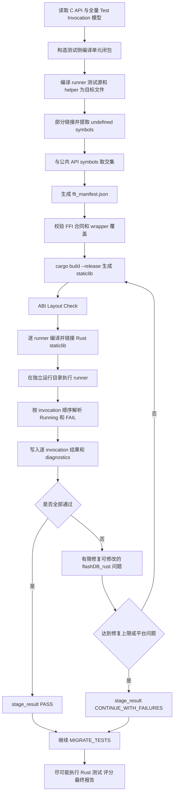

# Q5：C-CROSS 执行失败优化方案

> 文档状态：已确认，待实施  
> 设计依据：`design_doc/FlashDB_C_CROSS_设计说明书.md` 及 2026-07-10 方案评审结论  
> 适用范围：`02_02` FlashDB C-to-Rust 比赛工作台  
> 核心目标：真实执行“完整 Rust 实现 + 全部原 C 测试 invocation”，保留逐用例结果；任何中间失败不得导致比赛无结果。

---

## 1. 问题结论

最新版 C-CROSS 设计的核心方向合理：

1. `REWRITE_CORE_MODULES` 必须交付完整 Rust 实现；
2. C-CROSS 必须真实构建 Rust `staticlib`；
3. 原 C runner 必须链接 Rust C ABI facade 并真实运行；
4. runner 注册的所有测试 invocation 都必须进入 C-CROSS；
5. 失败必须保留真实证据，不得通过禁用用例、stub 或固定成功值规避；
6. C-CROSS 只负责验证和诊断，不负责在验证工具中补写业务逻辑；
7. 比赛流水线必须完赛，至少输出已通过的用例和最终结果，不能因中间 gate 终止而得到 0 分。

但原设计与当前工作台存在五处需要统一的合同：

- C-CROSS 全量 invocation 与 scorer case 集合混用；
- “允许继续比赛”与“C-CROSS 验证通过”混用；
- 工具链缺陷错误回派给比赛 subagent；
- FFI required symbols 推导缺少完整编译单元闭包；
- C-CROSS 产物路径存在两套写法。

本文件给出已确认的统一执行口径。

---

## 2. 已确认决策

### 2.1 C-CROSS 与评分集合分离

C-CROSS 的执行范围以 `c_test_model.json.registered_test_invocations` 为准，必须覆盖 runner 注册的全部 invocation。

Rust 测试迁移和评分仍以 `scorer_standard_cases` 为准。两个集合不得互相替代，只通过稳定的 `scenario_id` 建立关联：

```text
registered_test_invocations
        │
        ├── 全量进入 C-CROSS
        │
        └── scenario_id 关联 scorer_standard_cases
                              │
                              └── Rust 测试迁移与评分
```

约束：

- 不以 scorer case 数量限制 C-CROSS 用例数量；
- 不要求每个 C-CROSS invocation 必须有 scorer case；
- scorer case 缺失不允许导致原 C invocation 被跳过；
- Rust 测试迁移不得反向扩大或缩小 C-CROSS 执行范围；
- 所有数量均从当前 C 工程动态提取，不硬编码固定用例总数。

### 2.2 完赛状态与验证状态分离

比赛要求必须输出结果。因此 C-CROSS 失败后仍要继续执行后续流程，尽可能通过更多 Rust 测试和评分用例。

必须同时记录两个不同维度：

```text
stage_result:
  PASS
  CONTINUE_WITH_FAILURES

verification_result:
  pass
  partial
  failed
  unresolved
```

解释：

- `PASS`：C-CROSS 全部验证要求满足；
- `CONTINUE_WITH_FAILURES`：C-CROSS 存在失败或证据不足，但比赛继续；
- `partial`：一部分 invocation 已通过，另一部分失败或未完成；
- `unresolved`：工具链问题、解析失败或证据不足，不能判断 Rust 语义是否正确。

`CONTINUE_WITH_FAILURES` 是流程放行结果，不是验证通过。最终报告必须保留通过数、失败数、未运行数、解析失败数和 unresolved 数，不得将其汇总为 C-CROSS PASS。

### 2.3 平台问题由主控登记

以下问题属于工作台或平台问题，不回派给比赛 subagent 修改：

- Parser 无法解析合法 runner 输出；
- Test Invocation 模型错误或字段缺失；
- `gate.py` 合同错误；
- `c_cross_validate.py` 内部异常；
- `build_c_model.py` 生成错误；
- 必须修改 `work/**` 才能解决的其他问题。

主控负责：

1. 写入 `logs/trace/c-cross/workbench-issues.jsonl`；
2. 记录工具、原因、证据和受影响的 scenario；
3. 将受影响 scenario 标记为 `unresolved`；
4. 将阶段结果设为 `CONTINUE_WITH_FAILURES`；
5. 继续 Rust 测试迁移、执行、评分和最终报告。

比赛运行期间不得让 `c-analyzer`、`rust-implementer`、`test-migrator` 或 `repairer` 修改 `work/**` 绕过问题。

### 2.4 FFI 推导必须覆盖完整测试编译单元

`required_ffi_apis` 继续采用以下事实链：

```text
测试侧部分链接后的 undefined symbols
∩
C 公共 API symbols
=
required_ffi_apis
```

但“测试侧目标文件”必须形成完整编译单元闭包，包括：

- 原 C runner；
- runner 注册测试所在的测试源文件；
- 测试依赖的 helper 源文件；
- 测试框架所需、但不属于 FlashDB 核心实现的支持文件。

推导阶段禁止链接原 FlashDB C 核心实现。否则原实现会消解 undefined symbols，导致 FFI 清单漏项，并使最终运行不再是“Rust 实现 + 原 C 测试”。

测试侧编译或部分链接失败时必须留下真实命令和日志，不能退回静态猜测的固定 FFI 列表。

### 2.5 统一 C-CROSS 产物路径

唯一机器证据根目录为：

```text
logs/trace/c-cross/
```

不得创建或依赖：

```text
flashDB_rust/c_cross/
```

Rust 最终项目只包含 Rust 源码、Cargo 配置和 Rust 测试；临时 C 源码、runner 二进制、运行目录和 C-CROSS 日志全部留在 trace 中。

---

## 3. Test Invocation 数据合同

当前 `registered_test_invocations` 仍使用 `name`、`source_index`、`scenarios` 等字段，与新设计不一致。P0 必须完成一次明确的数据模型迁移。

每次 invocation 的标准结构为：

```json
{
  "suite": "tsdb",
  "runner": "tests/tsdb_main.c",
  "test_function": "test_fdb_tsl_clean",
  "invocation_index": 2,
  "runner_order": 21,
  "scenario_id": "test_fdb_tsl_clean__2",
  "source_file": "tests/fdb_tsdb_tc.c",
  "source_line": 507
}
```

字段约束：

| 字段 | 合同 |
|---|---|
| `suite` | 从当前 runner/test 事实动态提取，不硬编码仅支持 KVDB/TSDB |
| `runner` | 实际包含注册调用的 runner 文件，不用测试实现文件冒充 runner |
| `test_function` | `TEST_RUN(...)` 中真实函数名 |
| `invocation_index` | 同一 runner 内同名函数的第几次调用 |
| `runner_order` | invocation 在该 runner 中的真实执行顺序 |
| `scenario_id` | invocation 的稳定唯一标识 |
| `source_file` | 测试函数实现所在文件 |
| `source_line` | `TEST_RUN(...)` 注册点的真实源码行号 |

迁移后不得继续用单个 `source_index` 混合表达源码行号、runner 顺序和重复调用序号。

兼容策略：生产者和消费者在同一轮修改中同步切换；不得长期保留两套字段并让消费者猜测优先级。

---

## 4. C-CROSS 执行链

完整执行顺序如下：



任一前置层失败时，后续无法执行的 invocation 必须记录为 `not_run` 或 `unresolved`，并指向对应层日志；不得生成伪造的逐用例 pass/fail。

---

## 5. Runner 构建与执行

### 5.1 Runner 发现

runner 必须来自 `registered_test_invocations[].runner`，不能仅凭文件名包含 suite 名或搜索到 `main()` 后打分猜测。

同一 runner 的 invocation 按 `runner_order` 执行和解析。若模型指向不存在的 runner，属于模型或平台问题，由主控登记。

### 5.2 编译与链接

每个 runner 的真实链接输入至少包括：

```text
runner 对象
+ 测试实现对象
+ 测试 helper/框架对象
+ Rust staticlib
+ 必要系统库
```

不得加入 FlashDB C 核心实现对象或库。

每次执行必须保存：

- 完整编译命令；
- 完整链接命令；
- 编译器 stdout/stderr；
- 链接器 stdout/stderr；
- 返回码；
- 生成的 runner 路径。

### 5.3 独立运行目录

每个 suite/runner 使用独立目录，并在执行前清理：

```text
logs/trace/c-cross/runs/<suite>/<runner-id>/
```

这用于隔离数据库文件、Flash 模拟文件和上次运行残留。

### 5.4 Timeout

第一版 runner 固定 timeout 为 60 秒，不增加复杂进程平台。超时时：

```text
exit_code = -124
diagnosis = runtime_timeout
stage_result = CONTINUE_WITH_FAILURES
```

已经完成并成功解析的 invocation 保留原结果；尚未执行完成的 invocation 标记 `not_run`，不得把整个 suite 已通过的结果抹掉。

---

## 6. 结果解析与输出

### 6.1 重复 invocation

Parser 按 runner 实际输出顺序，将同名 `Running:` 映射到该 runner 中的第 N 次 invocation：

```text
第 1 次 Running: test_fdb_tsl_clean
  -> test_fdb_tsl_clean

第 2 次 Running: test_fdb_tsl_clean
  -> test_fdb_tsl_clean__2
```

重复 `Running:` 本身不是 `parse_failed`。

### 6.2 逐 invocation 状态

合法状态为：

```text
pass
fail
not_run
parse_failed
unresolved
```

含义：

- `pass`：已启动、没有对应 FAIL，且 runner 正常完成；
- `fail`：存在可归因到该 invocation 的测试失败；
- `not_run`：前置层失败或 runner 提前退出，未执行到该 invocation；
- `parse_failed`：runner 已产生输出，但无法可靠映射；
- `unresolved`：平台问题或证据不足，不能判断实现正确性。

### 6.3 结果保留原则

即使 runner 最终非零退出或 timeout，也应尽可能保留此前已经可靠解析的逐 invocation 结果。只有无法可靠归因的部分才标记 `parse_failed` 或 `unresolved`。

不得因为单个失败或解析问题，将整个 suite 的所有 invocation 批量改成同一失败状态。

---

## 7. Gate 和流水线合同

### 7.1 C-CROSS gate

`VERIFY_RUST_WITH_C_TESTS` gate 的职责改为：

1. 校验必需产物存在且格式正确；
2. 校验实际执行范围覆盖全部 registered invocation；
3. 校验所有失败、未运行和 unresolved 都有证据；
4. 计算 `PASS` 或 `CONTINUE_WITH_FAILURES`；
5. 无论哪种结果，都允许主控进入 `MIGRATE_TESTS`。

gate 不能把“允许比赛继续”写成“C-CROSS 已通过”。

### 7.2 后续阶段

当 C-CROSS 为 `CONTINUE_WITH_FAILURES` 时：

- `MIGRATE_TESTS` 继续；
- Rust 测试构建和执行继续；
- 能运行的测试全部运行；
- 评分继续；
- 最终报告继续生成；
- C-CROSS 未通过项保持 unresolved/fail/not_run；
- 后续 Rust 测试通过不能反向覆盖 C-CROSS 失败证据。

### 7.3 最终结果

最终报告至少输出：

```text
C-CROSS invocation 总数
C-CROSS pass / fail / not_run / parse_failed / unresolved
Rust 测试 pass / fail / not_run
已获得或预计可获得的评分结果
平台问题列表
参赛产物未解决问题列表
```

即使 C-CROSS 或 Rust 测试存在失败，也必须产出最终报告，避免因流程无输出得到 0 分。

---

## 8. 修复和责任边界

### 8.1 可自动修复

只有修改 `flashDB_rust/**` 可以解决的问题进入有限修复：

- Rust 编译失败；
- Rust staticlib 导出符号缺失；
- FFI wrapper 参数、返回值或错误码映射错误；
- Rust ABI facade 与事实合同不一致；
- Rust 核心语义导致原 C 测试失败。

修复达到上限后保留当前逐用例结果，阶段进入 `CONTINUE_WITH_FAILURES`。

### 8.2 不自动修复

需要修改 `work/**` 的平台问题不进行三次重复尝试，也不要求比赛 subagent修复。主控登记一次后继续流程。

### 8.3 简化 attempts

删除复杂 deferred/fingerprint 放行机制。`attempts.jsonl` 只记录：

```text
attempt
trigger
changed_files
before_summary
after_summary
result
```

`changed_files` 必须位于 `flashDB_rust/**`。Attempts 用于审计修复历史，不作为继续比赛的前置证明。

---

## 9. 核心产物

统一写入：

```text
logs/trace/
├── c_test_model.json
├── c_api_model.json
├── ffi_manifest.json
├── validation-matrix.json
└── c-cross/
    ├── build-check.json
    ├── layout-check.json
    ├── layout-check.log
    ├── link-check.json
    ├── cross-compile.log
    ├── cross-test.log
    ├── case-results.jsonl
    ├── diagnostics.jsonl
    ├── attempts.jsonl
    ├── workbench-issues.jsonl
    ├── runners/
    └── runs/
```

约束：

- 所有结果文件由工具生成，subagent 不得手写；
- `validation-matrix.json.scenarios` 覆盖全部 registered invocation；
- `scorer_case_id` 为可选关联字段，不得作为 C-CROSS scenario 的存在条件；
- `case-results.jsonl` 与矩阵中的 `scenario_id` 集合一致；
- 每个非 pass 结果必须有 diagnosis、handoff/owner、reason 和 evidence；
- 平台问题 owner 为主控，不伪装成 `c-analyzer` 修复任务。

---

## 10. 实施顺序

### P0：修复 Invocation 模型和 Parser

1. 将 `registered_test_invocations` 切换到标准字段；
2. 从注册点提取真实 runner、runner order 和 source line；
3. Parser 按 runner 内 invocation 顺序处理重复函数；
4. 非零退出和 timeout 时保留已经可靠解析的结果；
5. 为重复 invocation、提前退出、timeout 和未知输出增加测试。

### P1：分离 C-CROSS 与 scorer 集合

1. C-CROSS 从 `registered_test_invocations` 构造全量场景；
2. `scorer_standard_cases` 只用于 Rust 测试迁移和评分；
3. Gate 不再要求每个 C-CROSS 场景都有 `scorer_case_id`；
4. 增加集合覆盖和 `scenario_id` 唯一性检查。

### P2：实现完整测试编译单元与 FFI 事实链

1. 建立 runner 到测试源/helper 的动态依赖清单；
2. 编译测试侧全部必要目标文件；
3. 部分链接并提取 undefined symbols；
4. 与 C 公共 API symbols 取交集；
5. 生成并校验 `ffi_manifest.json`；
6. runner 最终只链接 Rust staticlib，不链接 C 核心实现。

### P3：改造软 Gate 和平台问题登记

1. 引入 `stage_result` 与 `verification_result`；
2. 删除 deferred/fingerprint 放行合同；
3. 新增 `workbench-issues.jsonl`；
4. 将平台问题 owner 固定为主控；
5. `CONTINUE_WITH_FAILURES` 后继续完整比赛流程；
6. 最终报告保留所有部分成绩和失败证据。

### P4：同步完整合同面

同步更新：

- `02_02/INSTRUCTION.md`；
- `02_02/work/skills/*.md`；
- `02_02/work/knowledge/**` 中相关政策；
- `.opencode/skills` 镜像；
- `c_cross_validate.py`；
- `build_c_model.py`；
- `gate.py`；
- `report_writer.py`；
- 相关工具测试和 gate 测试。

不得只修改单个脚本而保留互相冲突的旧合同。

---

## 11. 验收标准

### 11.1 真实性

- Rust `staticlib` 由当前 `flashDB_rust` 实际构建；
- 原 C runner 和测试实现实际编译；
- runner 实际链接 Rust C ABI facade；
- runner 实际运行并产生新日志；
- 最终 runner 不链接 FlashDB C 核心实现。

### 11.2 完整性

- 所有 registered invocation 均有且只有一条结果；
- 同名函数重复 invocation 能分别归因；
- GC、GC2、scale-up、iterator、status 等测试不得被排除；
- 不存在固定用例总数、固定排除列表或 `c_cross.enabled=false` 绕过。

### 11.3 完赛性

- 任一中间失败都不会阻止最终报告生成；
- 已通过用例的结果不会被后续 suite 失败覆盖；
- 未通过或证据不足的用例不会伪装为 pass；
- 最终报告能清晰区分通过、失败、未运行、解析失败和平台 unresolved；
- 比赛始终尝试运行后续 Rust 测试和评分，尽可能获得有效分数。

### 11.4 工具边界

- 比赛 subagent 不修改 `work/**`；
- 平台问题由主控写入 `workbench-issues.jsonl`；
- 自动修复只修改 `flashDB_rust/**`；
- 所有核心结果文件均由工具生成；
- 所有 C-CROSS 临时产物均位于 `logs/trace/c-cross/`。

---

## 12. 最终口径

C-CROSS 的成功目标仍是全部原 C invocation 通过，但比赛执行策略不是“全过才继续”，而是：

> 全量真实验证、逐用例保留结果、能修则有限修复、不能修则登记未解决问题，并继续完成 Rust 测试、评分和最终报告。

这同时保证三件事：

1. 不通过排除或伪造结果掩盖 Rust 实现缺陷；
2. 不因工具链或部分实现失败导致比赛没有输出、直接得到 0 分；
3. C-CROSS、Rust 测试和评分结果各自保留独立证据，可以在最终报告中准确解释当前迁移质量。
