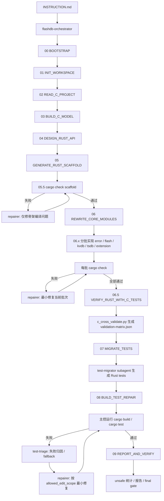

# FlashDB C-to-Rust opencode 参赛工程整体设计文档

## 1. 项目目标

本项目用于参加“将 FlashDB 用 Rust 重写”比赛。

参赛作品需要由 opencode 在评测环境中自动执行，读取平台提供的 FlashDB C 工程，将其核心源码与测试用例重写为 Rust，并生成可构建、可测试的 Rust 项目：

```text
flashDB_rust/
├── Cargo.toml
├── src/
└── tests/
```

最终要求：

```bash
cd flashDB_rust
cargo build
cargo test
```

能够成功执行，并且 Rust unsafe 使用比例低于 10%。

本项目不是提前提交一个完整 Rust 版 FlashDB，而是提交一个能被 opencode 自动执行的 **C-to-Rust 迁移工作台**。

本项目的通用性边界是：**专用迁移对象是 FlashDB，兼容目标是真实 FlashDB 输入的规模和布局变化**。真实评测输入可能比本地样例包含更多目录、源码、头文件、测试和 public 符号；系统必须全量记录并处理这些扩展项，但不承诺迁移任意无关 C 项目。详细策略见 `design_doc/flashdb-input-compatibility.md`。

---

## 2. 总体设计思路

整体设计采用：

```text
INSTRUCTION.md 作为总入口
    ↓
主控 Agent 负责流程编排
    ↓
Skill 提供阶段方法论
    ↓
Knowledge 固化规则和映射
    ↓
Python Tool 负责确定性扫描、检查、日志和统计
    ↓
必要时调用 Subagent 处理测试迁移和编译修复
    ↓
生成 flashDB_rust / result / logs
```

核心原则：

1. **INSTRUCTION.md 只负责入口和总约束**
   不把所有迁移细节塞进入口文件，避免变成长提示词。

2. **主控 Agent 负责流程推进**
   主控 Agent 维护阶段状态、选择 Skill、调用工具、触发 subagent，并判断是否完成。

3. **Skill 做渐进式披露**
   Skill 只在对应阶段加载，提供“怎么做”的方法，不直接承担流程调度。

4. **Python Tool 做确定性工作**
   文件扫描、cargo 执行、unsafe 统计、阶段检查等任务由工具完成，降低 Agent 跑偏风险。

5. **Subagent 只用于边界清晰任务**
   只拆测试迁移和编译修复，不拆核心代码迁移，避免 API 和架构不一致。

6. **FlashDB 核心域是下限，不是上限**
   `KVDB`、`TSDB`、`FlashStorage` 是必须覆盖的核心域，但真实 FlashDB 新增源码域不能被静默忽略。新增目录、文件、测试和 public `fdb_*` 符号必须进入模型、扩展设计、未映射清单或明确排除清单。

---

## 3. 目录结构设计

参赛作品目录建议如下：

```text
02_02/
├── INSTRUCTION.md
├── work/
│   ├── agents/
│   │   └── flashdb-orchestrator.md
│   ├── skills/
│   │   ├── test-migrator.md
│   │   ├── test-triage.md
│   │   ├── repairer.md
│   │   ├── flashdb-migration/
│   │   │   └── SKILL.md
│   │   ├── flashdb-test-migration/
│   │   │   └── SKILL.md
│   │   ├── rust-compile-repair/
│   │   │   └── SKILL.md
│   │   └── flashdb-report/
│   │       └── SKILL.md
│   ├── knowledge/
│   │   ├── contest-rules.md
│   │   ├── flashdb-test-map.md
│   │   └── flashdb-rust-architecture.md
│   └── tools/
│       ├── gate.py
│       ├── scan_c_project.py
│       ├── cargo_capture.py
│       ├── test_failure_triage.py
│       ├── unsafe_ratio.py
│       └── report_writer.py
├── result/
│   └── issues/
├── logs/
│   ├── interaction.md
│   └── trace/
└── README.md
```

执行完成后生成：

```text
02_02/
└── flashDB_rust/
    ├── Cargo.toml
    ├── src/
    └── tests/
```

---

## 4. 组件职责

### 4.1 INSTRUCTION.md

`INSTRUCTION.md` 是评测平台执行参赛作品的唯一入口。

职责：

* 声明任务目标；
* 声明平台 FlashDB 输入路径；
* 声明最终 Rust 项目输出路径；
* 要求 opencode 读取主控 Agent；
* 定义整体执行流程；
* 定义完成判定；
* 定义禁止事项。

`INSTRUCTION.md` 不承载大量技术细节，避免上下文过大。

---

### 4.2 主控 Agent

文件：

```text
work/agents/flashdb-orchestrator.md
```

职责：

* 读取 `INSTRUCTION.md`；
* 控制完整执行流程；
* 维护 `workflow_state.json`；
* 按阶段加载 Skill；
* 调用 Python Tool；
* 必要时调用 subagent；
* 判断阶段是否完成；
* 判断最终任务是否完成。

主控 Agent 是项目执行核心。

---

### 4.3 Subagent

本项目设计三个 subagent。按赛题目录约定，subagent Markdown 放在 `work/skills/{subagent}.md`，而不是 `work/agents/`。

#### test-migrator.md

职责：

* 根据 C 测试语义生成 Rust 测试；
* 覆盖 KVDB / TSDB 主干场景；
* 生成 `flashDB_rust/tests/`；
* 不大规模修改 `flashDB_rust/src/`。

#### repairer.md

职责：

* 根据 `cargo build` / `cargo test` 错误栈修复问题；
* 做最小补丁；
* 不删除测试；
* 不削弱断言；
* 不整体重写项目。

构建、测试和 gate 判定始终由主控 Agent 执行并归档。`repairer` 只在失败后负责最小修复，修复后必须由主控 Agent 复跑失败命令和对应 gate。

#### test-triage.md

职责：

* 在 `BUILD_TEST_REPAIR` 中分析单个失败 fingerprint；
* 输出 `test_oracle_suspect` / `rust_impl_suspect` / `harness_suspect` / `insufficient_evidence` 短 JSON 结论；
* 给出 `allowed_edit_scope` 和 `allow_src_edit`；
* 不运行 cargo，不修改文件，不判定 gate。

`test-triage` 是默认使用、自动降级组件。若 subagent 不可用、超时或输出不合格，主控 Agent 必须按同一规则 fallback 自行分类，流程不得等待人工确认。

---

### 4.4 Skill

Skill 是阶段方法论，不直接执行流程。

推荐 4 个 Skill：

```text
flashdb-migration
flashdb-test-migration
rust-compile-repair
flashdb-report
```

#### flashdb-migration

用于：

* 分析 FlashDB C 工程；
* 设计 Rust API；
* 设计 Rust 项目结构；
* 指导 FlashStorage / KVDB / TSDB 迁移。

#### flashdb-test-migration

用于：

* 分析 C 测试语义；
* 生成 Rust 测试；
* 覆盖 24 个标准测试场景；
* 确保测试断言有效。

#### rust-compile-repair

用于：

* 分析 Rust 编译错误；
* 分析 cargo test 失败；
* 指导最小补丁修复；
* 控制修复轮次和禁止行为。

#### flashdb-report

用于：

* 生成 `result/output.md`；
* 生成 `result/issues/00-summary.md`；
* 汇总构建、测试、unsafe 比例、已知问题和验证结果。

---

### 4.5 Knowledge

Knowledge 用于存放稳定规则和大表，避免重复提示。

推荐：

```text
contest-rules.md
flashdb-test-map.md
flashdb-rust-architecture.md
```

#### contest-rules.md

记录比赛硬约束：

* 输入路径；
* 输出路径；
* 构建要求；
* 测试要求；
* unsafe 比例要求；
* 禁止事项。

#### flashdb-test-map.md

记录测试覆盖目标：

* KVDB 13 个标准场景；
* TSDB 11 个标准场景；
* C 测试到 Rust 测试的语义映射原则。

#### flashdb-rust-architecture.md

记录 Rust 目标架构：

* `FlashStorage`
* `MemFlash`
* `FileFlash`
* `KvDb`
* `TsDb`
* `TslRecord`
* `FdbError`
* record / reload / gc 基本语义。

---

### 4.6 Tools

Python Tool 负责确定性任务，不作为主入口。

推荐：

```text
gate.py
scan_c_project.py
cargo_capture.py
unsafe_ratio.py
report_writer.py
```

#### gate.py

阶段门禁工具，用于检查当前阶段产物是否存在，防止主控 Agent 跳阶段。

#### scan_c_project.py

扫描 FlashDB 工程文件、头文件、测试文件和构建文件，输出结构化 manifest。扫描范围应覆盖 FlashDB 根目录下递归发现的相关 `.c/.h` 文件；`src/`、`inc/`、`tests/` 是常见目录，不是唯一目录。

#### cargo_capture.py

执行：

```bash
cargo build
cargo test
```

并将 stdout / stderr 保存到 `logs/trace/`。

#### unsafe_ratio.py

统计 `flashDB_rust/src/` 和 `flashDB_rust/tests/` 中 unsafe 使用比例。

#### report_writer.py

辅助生成 `result/output.md` 和 `result/issues/00-summary.md`。

---

## 5. 总体执行流程

主流程分为 10 个阶段：

```text
0. BOOTSTRAP
1. INIT_WORKSPACE
2. READ_C_PROJECT
3. BUILD_C_MODEL
4. DESIGN_RUST_API
5. GENERATE_RUST_SCAFFOLD
6. REWRITE_CORE_MODULES
6.5 VERIFY_RUST_WITH_C_TESTS
7. MIGRATE_TESTS
8. BUILD_TEST_REPAIR
9. REPORT_AND_VERIFY
```

每个阶段的输入、输出、执行主体、工具、约束和 gate 检查已拆分到：

```text
design_doc/stages/README.md
design_doc/stages/00-bootstrap.md
design_doc/stages/01-init-workspace.md
design_doc/stages/02-read-c-project.md
design_doc/stages/03-build-c-model.md
design_doc/stages/04-design-rust-api.md
design_doc/stages/05-generate-rust-scaffold.md
design_doc/stages/06-rewrite-core-modules.md
design_doc/stages/06-5-verify-rust-with-c-tests.md
design_doc/stages/07-migrate-tests.md
design_doc/stages/08-build-test-repair.md
design_doc/stages/09-report-and-verify.md
```

流程图：



构建检查节奏：

```text
05 生成骨架后：cargo check
06 每个实现批次后：cargo check
07 测试迁移后：cargo test 并记录结果，允许失败进入 08
08 最终闭环：cargo build + cargo test，失败则 repairer 最小修复
09 只做 unsafe、报告和最终 gate，不再大规模实现
```

---

## 6. 分阶段契约

每个阶段都必须明确：

```text
执行主体
输入
预期输出
完成标识
约束/验证方式
```

---

### 6.1 BOOTSTRAP

目标：让 opencode 从 `INSTRUCTION.md` 进入固定流程。

执行主体：

```text
opencode + flashdb-orchestrator
```

输入：

```text
INSTRUCTION.md
work/agents/flashdb-orchestrator.md
```

预期输出：

```text
主控 Agent 接管流程
```

完成标识：

* opencode 已读取 `flashdb-orchestrator.md`；
* 后续流程由主控 Agent 执行。

约束方式：

* `INSTRUCTION.md` 必须明确要求：开始任何迁移前，先读取主控 Agent。

---

### 6.2 INIT_WORKSPACE

目标：初始化结果目录和日志目录。

执行主体：

```text
flashdb-orchestrator + gate.py
```

输入：

```text
当前作品目录
```

预期输出：

```text
result/
result/issues/
logs/
logs/trace/
logs/interaction.md
logs/trace/workflow_state.json
logs/trace/01-init-workspace.md
```

完成标识：

* `result/issues/` 存在；
* `logs/trace/` 存在；
* `logs/interaction.md` 存在；
* `workflow_state.json` 存在。

验证方式：

```bash
python3 work/tools/gate.py --stage INIT_WORKSPACE
```

---

### 6.3 READ_C_PROJECT

目标：定位并读取平台 FlashDB C 工程。

执行主体：

```text
flashdb-orchestrator + scan_c_project.py
```

输入路径优先级：

```text
/app/code/judge-assets/02_02_c_to_rust/code/FlashDB
judge-assets/code/FlashDB
../judge-assets/code/FlashDB
```

预期输出：

```text
logs/trace/input_manifest.json
logs/trace/02-read-c-project.md
```

完成标识：

* 找到 FlashDB 根目录；
* 找到 `src/`；
* 找到 `tests/`；
* 递归记录全部相关 `.c/.h` 文件；
* 新增目录或文件进入扩展清单、忽略清单或待分类清单；
* 生成 `input_manifest.json`。

验证方式：

```bash
python3 work/tools/scan_c_project.py <FlashDB_PATH> logs/trace
python3 work/tools/gate.py --stage READ_C_PROJECT
```

---

### 6.4 BUILD_C_MODEL

目标：基于 C 源码和测试建立 C 项目模型。

执行主体：

```text
flashdb-orchestrator
+ flashdb-migration Skill
+ scan_c_project.py
```

输入：

```text
logs/trace/input_manifest.json
FlashDB/src/
FlashDB/tests/
FlashDB 根目录下递归发现的其他 .c/.h 文件
work/skills/flashdb-migration/SKILL.md
```

预期输出：

```text
logs/trace/c_project_model.json
logs/trace/c_api_model.json
logs/trace/c_test_model.json
logs/trace/03-build-c-model.md
```

模型至少包含：

* 源文件模型；
* API 模型；
* struct / macro 模型；
* KVDB 模块；
* TSDB 模块；
* 支持/扩展/未知模块；
* C 测试模型。

完成标识：

* `c_project_model.json` 存在；
* `c_api_model.json` 存在；
* `c_test_model.json` 存在；
* 已识别 KVDB / TSDB / tests；
* manifest 中相关 `.c/.h` 文件已被覆盖、分类、标记 unknown 或明确忽略；
* 新增 public `fdb_*` 符号没有静默丢弃。

验证方式：

```bash
python3 work/tools/gate.py --stage BUILD_C_MODEL
```

---

### 6.5 DESIGN_RUST_API

目标：在写 Rust 代码前，先固定 Rust API 和模块边界。

执行主体：

```text
flashdb-orchestrator + flashdb-migration Skill
```

输入：

```text
logs/trace/c_project_model.json
logs/trace/c_api_model.json
logs/trace/c_test_model.json
work/knowledge/flashdb-rust-architecture.md
```

预期输出：

```text
logs/trace/rust_api_design.json
logs/trace/04-design-rust-api.md
```

Rust API 至少包含：

* `FlashStorage`
* `MemFlash`
* `FileFlash`
* `FdbError`
* `KvDb`
* `TsDb`
* `TslRecord`
* KVDB public API
* TSDB public API
* 真实 FlashDB 新增 public API 的扩展设计或未映射清单

完成标识：

* `rust_api_design.json` 存在；
* KVDB / TSDB 测试侧 API 已固定；
* 新增源码域、扩展符号或未知项已有处理去向；
* 后续测试迁移以该 API 为准。

验证方式：

```bash
python3 work/tools/gate.py --stage DESIGN_RUST_API
```

---

### 6.6 GENERATE_RUST_SCAFFOLD

目标：根据 Rust API 设计生成 Rust 项目骨架，并立即确认骨架可以 `cargo check`。

执行主体：

```text
flashdb-orchestrator + flashdb-migration Skill
```

输入：

```text
logs/trace/rust_api_design.json
work/knowledge/flashdb-rust-architecture.md
```

预期输出：

```text
flashDB_rust/Cargo.toml
flashDB_rust/src/lib.rs
flashDB_rust/src/error.rs
flashDB_rust/src/flash.rs
flashDB_rust/src/kvdb.rs
flashDB_rust/src/tsdb.rs
flashDB_rust/src/<support-or-extension>.rs
flashDB_rust/tests/
logs/trace/05-generate-rust-scaffold.md
logs/trace/cargo-check-scaffold.log
logs/trace/scaffold-check.json
```

完成标识：

* `flashDB_rust/Cargo.toml` 存在；
* `flashDB_rust/src/` 存在；
* `flashDB_rust/tests/` 存在。
* `cargo check` 对骨架通过；
* `scaffold-check.json.status == pass`。

验证方式：

```bash
cd flashDB_rust
cargo check
cd ..
python3 work/tools/gate.py --stage GENERATE_RUST_SCAFFOLD
```

如果骨架 `cargo check` 失败，不进入 `REWRITE_CORE_MODULES`。修复范围只限 Cargo 配置、模块声明、类型签名、trait 声明和 API 空壳，不实现完整 KVDB/TSDB 语义。

---

### 6.7 REWRITE_CORE_MODULES

目标：实现 FlashDB 核心 Rust 逻辑，并在每个实现批次后运行 `cargo check`。

执行主体：

```text
flashdb-orchestrator + flashdb-migration Skill
```

输入：

```text
logs/trace/rust_api_design.json
logs/trace/c_project_model.json
flashDB_rust/src/
work/knowledge/flashdb-rust-architecture.md
```

预期输出：

```text
flashDB_rust/src/error.rs
flashDB_rust/src/flash.rs
flashDB_rust/src/kvdb.rs
flashDB_rust/src/tsdb.rs
logs/trace/06-rewrite-core-modules.md
logs/trace/core_rewrite_batches.jsonl
logs/trace/cargo-check-06-*.log
```

核心能力：

* `FlashStorage`
* `MemFlash`
* `FileFlash`
* KVDB init / set / get / delete / update / gc / reload / deinit
* TSDB init / append / iter / query / clean / status / reload / deinit

完成标识：

* 核心函数不是空实现；
* 不存在明显 `todo!()` / `unimplemented!()`；
* 数据写入体现 record append 语义；
* delete 体现 tombstone 语义；
* reload 能从 storage 扫描恢复。
* `error`、`flash`、`kvdb`、`tsdb` 至少四个批次均有 `cargo check` 通过记录。

验证方式：

```bash
python3 work/tools/gate.py --stage REWRITE_CORE_MODULES
```

执行节奏：

```text
error.rs -> cargo check
flash.rs -> cargo check
kvdb.rs -> cargo check
tsdb.rs -> cargo check
support/extension -> cargo check（如存在）
```

任一批次失败时，先修当前批次。`repairer` 可以参与修复，但构建命令和 gate 必须由主控 Agent 复跑。

---

### 6.8 VERIFY_RUST_WITH_C_TESTS

目标：在迁移 Rust 测试前，用原始 C 测试场景验证 Rust core，生成 `Rust Impl x C Test` 证据矩阵。

执行主体：

```text
flashdb-orchestrator
c_cross_validate.py
gate.py
```

输入：

```text
logs/trace/c_test_model.json
logs/trace/c_api_model.json
logs/trace/rust_api_design.json
flashDB_rust/
```

预期输出：

```text
logs/trace/c-cross/cross-compile.log
logs/trace/c-cross/cross-test.log
logs/trace/validation-matrix.json
logs/trace/06-5-verify-rust-with-c-tests.md
```

完成标识：

* `validation-matrix.json` 覆盖全部 scorer-standard cases；
* `rust_impl_c_test == fail` 会阻断后续阶段；
* `not_supported` 必须包含 reason 和 `logs/trace/c-cross/` 下的 log；
* `flashDB_rust/src/` 下递归不存在 `.c` 文件。

验证方式：

```bash
python3 work/tools/c_cross_validate.py --root . --project flashDB_rust --out logs/trace
python3 work/tools/gate.py --stage VERIFY_RUST_WITH_C_TESTS
```

本阶段只提供迁移过程验证证据，不让最终 Rust 项目依赖 FlashDB C 实现。

---

### 6.9 MIGRATE_TESTS

目标：将 C 测试语义迁移为 Rust 测试，并维护 `rust_test_mapping.json`。

执行主体：

```text
test-migrator subagent
+ flashdb-test-migration Skill
```

输入：

```text
logs/trace/c_test_model.json
logs/trace/rust_api_design.json
flashDB_rust/src/
work/knowledge/flashdb-test-map.md
work/skills/flashdb-test-migration/SKILL.md
```

预期输出：

```text
flashDB_rust/tests/kvdb_tests.rs
flashDB_rust/tests/tsdb_tests.rs
flashDB_rust/tests/equivalence_tests.rs
logs/trace/rust_test_mapping.json
logs/trace/07-migrate-tests.md
```

测试覆盖：

```text
KVDB 13 个标准场景
TSDB 11 个标准场景
总计 24 个标准场景
```

完成标识：

* Rust 测试文件存在；
* `rust_test_mapping.json` 覆盖 24 个标准场景；
* 每个测试有明确断言；
* `validated_obligations` 覆盖每个 scorer case 的 `semantic_obligations`。

验证方式：

```bash
python3 work/tools/gate.py --stage MIGRATE_TESTS
```

本阶段不要求 `cargo test` 必须通过；最终 cargo build/test 由 `BUILD_TEST_REPAIR` 运行和归档。这样 07 负责“生成准确测试”，08 负责“最终行为修复闭环”。

---

### 6.10 BUILD_TEST_REPAIR

目标：执行最终 Rust 构建和测试，并在失败时自动修复。

05 已经检查骨架可编译，06 已经分批 `cargo check`，06.5 已经生成 C 测试交叉验证矩阵，07 已经生成 Rust 测试映射。因此 08 主要处理最终集成问题、测试失败和边界语义差异，不应承担所有早期编译错误。

执行主体：

```text
flashdb-orchestrator
+ cargo_capture.py
+ test_failure_triage.py
+ test-triage subagent
+ repairer subagent
+ rust-compile-repair Skill
```

输入：

```text
flashDB_rust/
work/skills/rust-compile-repair/SKILL.md
```

执行命令：

```bash
cd flashDB_rust
cargo fmt
cargo build
cargo test
```

预期输出：

```text
logs/trace/cargo-build.log
logs/trace/cargo-test.log
logs/trace/cargo-results.json
logs/trace/test-failure-triage.jsonl
logs/trace/08-build-test-repair.md
result/issues/repair_trace.jsonl
```

失败时：

```text
主控提取失败 fingerprint
运行 test_failure_triage.py 生成 test-failure-triage.jsonl
默认调用 test-triage；失败时主控 fallback 自行分类
写入 workflow_state.json.test_failure_triage_required = true
根据 triage 的 allowed_edit_scope 授权 repairer 最小补丁
最多 8 轮
```

主控 Agent 必须亲自运行 cargo 命令、归档日志并判断是否进入下一轮；`test-triage` 只负责短归因结论，`repairer` 只负责授权范围内的最小修复。

测试失败分类：

* `test_oracle_suspect`：断言期望值可疑，只能先修 tests、mapping 或测试说明；
* `rust_impl_suspect`：C evidence、spec evidence 或 validated obligation 支持期望值，允许修 `flashDB_rust/src/`；
* `harness_suspect`：setup、mock flash、C ABI facade、wrapper、状态清理或初始化顺序可疑，优先修 harness；
* `insufficient_evidence`：最多补一轮证据，然后按失败类型保守推进，不能无限停住。

完成标识：

* `cargo build` 成功；
* `cargo test` 成功；
* `cargo-results.json.build_status == pass`；
* `cargo-results.json.test_status == pass`；
* `workflow_state.json` 中 `build_status = pass`；
* `workflow_state.json` 中 `test_status = pass`。

验证方式：

```bash
python3 work/tools/cargo_capture.py --project flashDB_rust --out logs/trace
python3 work/tools/test_failure_triage.py --root . --out logs/trace  # only required when cargo test failed
python3 work/tools/gate.py --stage BUILD_TEST_REPAIR
```

禁止：

* 删除测试；
* 削弱断言；
* 把测试改成恒真；
* 所有函数直接返回 Ok；
* 整体重写项目；
* 修改平台输入目录。

---

### 6.11 REPORT_AND_VERIFY

目标：生成最终报告和验证记录。

执行主体：

```text
flashdb-orchestrator
+ flashdb-report Skill
+ unsafe_ratio.py
+ report_writer.py
```

输入：

```text
logs/trace/workflow_state.json
logs/trace/c_project_model.json
logs/trace/rust_api_design.json
logs/trace/validation-matrix.json
logs/trace/rust_test_mapping.json
logs/trace/cargo-build.log
logs/trace/cargo-test.log
flashDB_rust/
```

预期输出：

```text
result/output.md
result/issues/00-summary.md
logs/trace/final-verification.md
logs/trace/09-report-and-verify.md
```

报告内容：

* 输入路径；
* Rust 输出路径；
* C 工程分析摘要；
* Rust API 设计摘要；
* 测试覆盖情况；
* cargo build 结果；
* cargo test 结果；
* unsafe 比例；
* 已知问题。

完成标识：

* `result/output.md` 存在；
* `result/issues/00-summary.md` 存在；
* `logs/trace/final-verification.md` 存在；
* unsafe ratio 低于 10%；
* `workflow_state.json` 状态为 `DONE`。

验证方式：

```bash
python3 work/tools/unsafe_ratio.py --project flashDB_rust --out logs/trace
python3 work/tools/gate.py --stage REPORT_AND_VERIFY
```

---

## 7. 子 Agent 与分支关系

整体流程由主控 Agent 串行推进，只在两个阶段分支。

```text
flashdb-orchestrator
    │
    ├── MIGRATE_TESTS
    │       └── test-migrator subagent
    │
    └── BUILD_TEST_REPAIR
            └── repairer subagent
```

不拆以下 subagent：

```text
C analyzer
Rust architect
KVDB rewriter
TSDB rewriter
Reporter
```

原因：

* C 分析、API 设计需要统一视角；
* KVDB / TSDB / FlashStorage 强耦合；
* 核心迁移必须保持上下文连续；
* 报告阶段需要主控统一收口；
* 过多 subagent 会增加接口不一致风险。

---

## 8. 流程控制机制

为避免 opencode 跑偏，使用：

```text
workflow_state.json + gate.py + 阶段日志
```

### 8.1 workflow_state.json

记录：

* 当前阶段；
* 已完成阶段；
* 输入路径；
* Rust 项目路径；
* build 状态；
* test 状态；
* 修复轮次；
* unsafe 比例；
* 阻塞问题。

### 8.2 gate.py

每阶段完成后检查产物是否存在。

示例：

```bash
python3 work/tools/gate.py --stage DESIGN_RUST_API
```

gate 不通过，不进入下一阶段。

### 8.3 阶段日志

每阶段写入：

```text
logs/trace/<stage-name>.md
```

用于记录：

* 本阶段执行内容；
* 输入；
* 输出；
* 失败原因；
* gate 结果。

---

## 9. Rust 目标项目原则

Rust 项目采用简化但语义完整的 FlashDB 重写方案。

核心原则：

1. safe Rust 优先；
2. unsafe 比例低于 10%；
3. `FlashStorage` 是存储抽象；
4. `HashMap` 只能作为运行时索引；
5. 数据写入必须体现 record append 语义；
6. delete 需要 tombstone；
7. init / reload 需要从 storage 扫描恢复；
8. gc 需要保留最新有效记录；
9. Rust tests 必须覆盖 C tests 主干语义；
10. 真实 FlashDB 新增源码域必须被映射到支持/扩展模块、未映射清单或明确排除清单。

目标 Rust 结构：

```text
flashDB_rust/
├── Cargo.toml
├── src/
│   ├── lib.rs
│   ├── error.rs
│   ├── flash.rs
│   ├── kvdb.rs
│   ├── tsdb.rs
│   └── <support-or-extension>.rs
└── tests/
    ├── kvdb_tests.rs
    ├── tsdb_tests.rs
    └── equivalence_tests.rs
```

其中 `error.rs`、`flash.rs`、`kvdb.rs`、`tsdb.rs` 是核心模块；真实 FlashDB 输入如果需要额外支持模块，由 `rust_api_design.json.support_modules` 或 `rust_api_design.json.extension_modules` 决定生成。四个核心模块是下限，不是 Rust 文件数量上限。

---

## 10. 最终交付结果

执行完成后应生成：

```text
flashDB_rust/
├── Cargo.toml
├── src/
└── tests/

result/
├── output.md
└── issues/
    └── 00-summary.md

logs/
├── interaction.md
└── trace/
```

最终完成判定：

```text
flashDB_rust/Cargo.toml 存在
flashDB_rust/src/ 存在
flashDB_rust/tests/ 存在
cargo build 成功
cargo test 成功
result/output.md 存在
result/issues/00-summary.md 存在
unsafe 比例低于 10%
workflow_state.json 状态为 DONE
```

---

## 11. 设计取舍

本项目采用：

```text
一个主控 Agent
+ 三个 subagent
+ 四个 Skill
+ 少量 Knowledge
+ Python 辅助工具
+ 状态文件和阶段门禁
```

不采用：

* 每阶段一个 subagent；
* 超级主控 Skill；
* 单一 Python 脚本作为全部入口；
* 预置完整 Rust 项目作为唯一交付；
* 通用 C-to-Rust 编译器路线。

原因：

* 单一赛题需要上下文连续；
* 核心迁移阶段需要统一 API 和数据模型；
* Skill 适合渐进式披露；
* Python 工具适合确定性检查；
* subagent 只适合边界清晰任务。

---

## 12. 总结

本工程的核心架构是：

```text
INSTRUCTION.md
    ↓
flashdb-orchestrator
    ↓
按阶段加载 Skill
    ↓
必要时调用 test-migrator / repairer
    ↓
使用 Python 工具完成确定性检查
    ↓
生成 flashDB_rust / result / logs
```

该架构的目标是让 opencode 在评测环境中稳定、自动、可审计地完成 FlashDB C-to-Rust 迁移。
