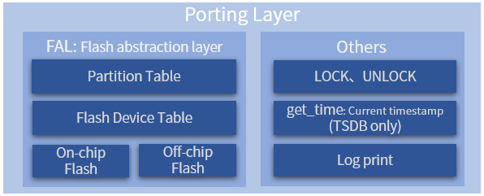

# Porting Guide

FlashDB uses file-based storage mode on Linux. This mode uses regular files on the filesystem to simulate Flash storage, and does not require real Flash hardware.

## Porting Introduction



The main porting work is to configure the file mode and provide lock/unlock callbacks. Other interfaces are not strongly dependent and can be connected according to your own situation.

## File Mode Porting (Linux)

On Linux or any POSIX-compatible platform, FlashDB uses file-based storage mode. This mode uses regular files on the filesystem to simulate Flash storage, and does not require real Flash hardware.

### POSIX file mode

Enable `FDB_USING_FILE_POSIX_MODE` in `fdb_cfg.h`. This mode uses `open/read/write/close` POSIX file APIs. The database name parameter in `fdb_kvdb_init` / `fdb_tsdb_init` becomes the directory path where the database files are stored.

### libc file mode

Enable `FDB_USING_FILE_LIBC_MODE` in `fdb_cfg.h`. This mode uses `fopen/fread/fwrite/fclose` C standard library file APIs.

> FDB_USING_FILE_LIBC_MODE and FDB_USING_FILE_POSIX_MODE can ONLY be one. File mode has no limitation on storage location, size and quantity.

### Lock and unlock

On Linux, use `pthread_mutex_lock` / `pthread_mutex_unlock` as lock and unlock callbacks:

```C
static pthread_mutex_t db_lock = PTHREAD_MUTEX_INITIALIZER;

static void lock(fdb_db_t db) {
    pthread_mutex_lock((pthread_mutex_t *)db->user_data);
}

static void unlock(fdb_db_t db) {
    pthread_mutex_unlock((pthread_mutex_t *)db->user_data);
}

fdb_kvdb_control(&kvdb, FDB_KVDB_CTRL_SET_LOCK, lock);
fdb_kvdb_control(&kvdb, FDB_KVDB_CTRL_SET_UNLOCK, unlock);
fdb_kvdb_control(&kvdb, FDB_KVDB_CTRL_SET_FILE_MODE, (bool *)(&file_mode));
fdb_kvdb_control(&kvdb, FDB_KVDB_CTRL_SET_USER_DATA, &db_lock);
```
