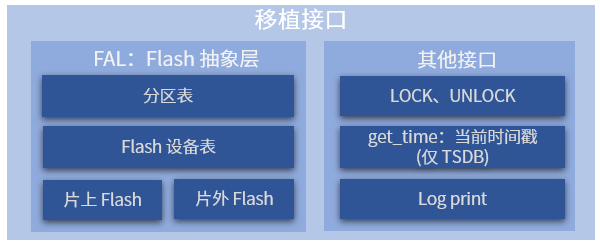

# 移植指南

FlashDB 在 Linux 上使用基于文件的存储模式。该模式使用文件系统上的普通文件来模拟 Flash 存储，不需要真实 Flash 硬件。

## 移植介绍



移植的主要工作是配置文件模式并提供加锁/解锁回调。其他接口并不是强依赖，可以根据自己的情况进行对接。

## 文件模式移植（Linux）

在 Linux 或任何兼容 POSIX 的平台上，FlashDB 使用基于文件的存储模式。该模式使用文件系统上的普通文件来模拟 Flash 存储，不需要真实 Flash 硬件。

### POSIX 文件模式

在 `fdb_cfg.h` 中启用 `FDB_USING_FILE_POSIX_MODE`。该模式使用 `open/read/write/close` POSIX 文件 API。`fdb_kvdb_init` / `fdb_tsdb_init` 中的数据库名参数成为数据库文件存储的目录路径。

### libc 文件模式

在 `fdb_cfg.h` 中启用 `FDB_USING_FILE_LIBC_MODE`。该模式使用 `fopen/fread/fwrite/fclose` C 标准库文件 API。

> FDB_USING_FILE_LIBC_MODE 与 FDB_USING_FILE_POSIX_MODE 只能二选一。文件模式下数据库的存储位置、大小及数量没有限制。

### 加锁与解锁

在 Linux 上，使用 `pthread_mutex_lock` / `pthread_mutex_unlock` 作为加锁和解锁回调：

```C
static pthread_mutex_t db_lock = PTHREAD_MUTEX_INITIALIZER;

static void lock(fdb_db_t db) {
    pthread_mutex_lock((pthread_mutex_t *)db->user_data);
}

static void unlock(fdb_db_t db) {
    pthread_mutex_unlock((pthread_mutex_t *)db->user_data);
}

fdb_kvdb_control(&kvdb, FDB_KVDB_CTRL_SET_LOCK, lock);
fdb_kvdb_control(&kvdb, FDB_KVDB_CTRL_SET_UNLOCK, unlock);
fdb_kvdb_control(&kvdb, FDB_KVDB_CTRL_SET_FILE_MODE, (bool *)(&file_mode));
fdb_kvdb_control(&kvdb, FDB_KVDB_CTRL_SET_USER_DATA, &db_lock);
```
